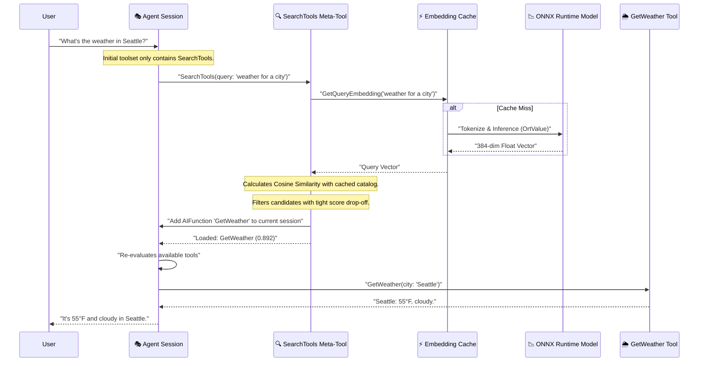

import Tabs from '../../../components/Tabs.astro';
import TabItem from '../../../components/TabItem.astro';

## Overview

When you start building AI agents, you might begin by giving them three or four tools—like a weather calculator, a clock, and a search engine. But what happens when your agent needs to choose from dozens, hundreds, or even thousands of tools in an enterprise system? 

If you try to feed every tool definition into the agent's prompt at the same time, you will quickly hit a wall. Feeding too many tools into the prompt:
1. **Wastes valuable tokens**: You pay for sending unused tool descriptions on every single turn.
2. **Increases latency**: The LLM takes longer to process the prompt.
3. **Confuses the agent**: Models can suffer from the "lost in the middle" problem, where they overlook tools listed in the middle of a massive prompt.

To solve this, we can implement **Dynamic Semantic Tool Search** (often called "RAG for Tools"). Instead of giving the agent every tool upfront, we give it a single "meta-tool" called `SearchTools`. When the agent needs a capability it doesn't currently have, it calls this search function, finds the most relevant tools locally using a fast embedding database, loads them dynamically, and then continues its execution.

<div class="solid-callout solid-callout-info my-6">
  <p class="font-bold text-indigo-900 mb-2 text-sm">💡 Key Pattern: Tool Retrieval (Tool RAG)</p>
  <p class="text-xs text-indigo-900/80 leading-relaxed">
    This pattern aligns with modern AI engineering practices often referred to as **Tool Retrieval (Tool RAG)** or **Dynamic Tool Selection**. In large-scale agentic systems, dynamic tool selection mitigates prompt bloat, latency, and model confusion by scoping active tools to the minimum set required for the immediate task.
  </p>
</div>

In this tutorial, we will build a complete .NET console application that implements local tokenization, semantic search using on-device machine learning models, and high-performance caching.

## Agent Anatomy

In this architecture, we extend a standard agent with a local discovery capability. The system is split into three main components:

<div class="grid grid-cols-1 sm:grid-cols-3 gap-4 my-10">
  {/* The Base Agent */}
  <div class="p-5 rounded-2xl bg-slate-50/50 border border-slate-200/60 shadow-sm opacity-60 grayscale transition-all hover:grayscale-0 hover:opacity-100 animate-fade-in">
    <div class="w-10 h-10 rounded-xl bg-white shadow-sm flex items-center justify-center text-xl mb-4 border border-slate-100">🤖</div>
    <div class="font-bold text-slate-900 mb-1 text-sm">1. Base Agent</div>
    <p class="text-[11px] leading-relaxed text-slate-500">The agent's core brain, system instructions, and execution session. Initially, it is only aware of the search meta-tool.</p>
  </div>

  {/* Local Embedding Engine */}
  <div class="p-5 rounded-2xl bg-white border-2 border-emerald-500 shadow-xl shadow-emerald-500/10 transition-all hover:-translate-y-1 relative overflow-hidden animate-fade-in animate-delay-1">
    <div class="absolute top-0 right-0 px-2 py-0.5 bg-emerald-500 text-[9px] font-black text-white rounded-bl-lg tracking-tighter uppercase">Local</div>
    <div class="w-10 h-10 rounded-xl bg-emerald-50 flex items-center justify-center text-xl mb-4 border border-emerald-100">📉</div>
    <div class="font-bold text-slate-900 mb-1 text-sm">2. Local Embedding Engine</div>
    <p class="text-[11px] leading-relaxed text-slate-600 font-medium">An on-device BERT Tokenizer and ONNX model that translate natural language text into numeric vectors (embeddings) instantly.</p>
  </div>

  {/* Discovery System */}
  <div class="p-5 rounded-2xl bg-white border-2 border-indigo-500 shadow-xl shadow-indigo-500/10 transition-all hover:-translate-y-1 relative overflow-hidden animate-fade-in animate-delay-2">
    <div class="absolute top-0 right-0 px-2 py-0.5 bg-indigo-500 text-[9px] font-black text-white rounded-bl-lg tracking-tighter uppercase">Active</div>
    <div class="w-10 h-10 rounded-xl bg-indigo-50 flex items-center justify-center text-xl mb-4 border border-indigo-100">🔍</div>
    <div class="font-bold text-slate-900 mb-1 text-sm">3. Discovery Meta-Tool</div>
    <p class="text-[11px] leading-relaxed text-slate-600 font-medium">The <code>SearchTools</code> function that calculates similarities, filters relevant options, and registers them directly into the active session.</p>
  </div>
</div>

<div class="premium-gradient border border-indigo-100 rounded-3xl p-8 my-12 shadow-sm relative overflow-hidden animate-fade-in animate-delay-4">
  <div class="absolute -top-10 -right-10 w-40 h-40 bg-indigo-500/5 rounded-full blur-3xl"></div>
  <div class="flex gap-5 relative z-10">
    <div class="flex-shrink-0 w-12 h-12 rounded-2xl bg-indigo-600 flex items-center justify-center text-white shadow-lg shadow-indigo-200">
      <svg xmlns="http://www.w3.org/2000/svg" width="24" height="24" viewBox="0 0 24 24" fill="none" stroke="currentColor" stroke-width="2.5" stroke-linecap="round" stroke-linejoin="round"><path d="M21 21l-6-6m2-5a7 7 0 11-14 0 7 7 0 0114 0z"/></svg>
    </div>
    <div>
      <h4 class="text-indigo-950 font-black text-lg tracking-tight mb-2">Why Local Embeddings & Caching?</h4>
      <p class="text-sm leading-relaxed text-indigo-900/70 max-w-2xl">
        Running a small model like **MiniLM** locally via **ONNX Runtime** is fast, private, and free. However, running inference on every turn can still impact performance. By pairing local ONNX models with a high-performance **FusionCache** L1/L2 cache layer, we eliminate redundant computation, instantly recovering embeddings on app restarts.
      </p>
    </div>
  </div>
</div>

## Core Concepts Explained

Before writing code, let’s understand the core building blocks. If you are new to AI development, these concepts might seem complex, but they can be broken down using simple everyday analogies.

### 1. What are Vector Embeddings?
In computing, we store text as strings (letters and symbols). But machines are bad at comparing the *meanings* of strings. For example, a keyword search for "temp" won't find a tool called `GetWeather` because the letters don't match.

An **embedding** is a way of translating text into a list of numbers (a vector) that represents its meaning. 
*   **The Analogy**: Imagine a giant map of ideas. "Seattle weather" and "rain forecast" would be pinned next to each other on this map because they are closely related. "Stock price of Apple" would be pinned in a completely different neighborhood. 
*   **Vector Space**: If we measure the distance between two pins on our map, we can tell how similar they are. In machine learning, we use a 384-dimensional map (meaning each coordinate has 384 numbers). 
*   **Similarity Math**: We compare two vectors using a **Dot Product**. When our vectors are normalized (scaled to a length of 1), the dot product gives us a score between `-1.0` and `1.0`. A score close to `1.0` means the concepts are nearly identical in meaning.

### 2. Tokenization: Translating Words to Numbers
Before a neural network can turn a sentence into an embedding, it must break the sentence down into pieces it understands. This is called **tokenization**.
*   **WordPiece Tokenization**: Rather than breaking text by space or character, we break it into common subwords. For instance, the word "unhelpful" might be broken into the tokens `un` and `helpful`. This prevents the model from failing when it encounters a word it hasn't seen before.
*   **Case Sensitivity**: Uncased models ignore capitalization. In our setup, we specify `LowerCaseBeforeTokenization = true` so that "Seattle", "SEATTLE", and "seattle" are tokenized exactly the same way.
*   **Special Tokens**: Models like BERT require structural markers. We add `[CLS]` (Classification) at the start of every sentence (which the model uses to summarize the meaning of the entire sentence) and `[SEP]` (Separator) at the end.

### 3. ONNX Runtime: On-Device Intelligence
Running AI models usually requires calling an API key over the internet. This is slow, costs money per request, and sends potentially sensitive tool schemas to a third-party server.

**ONNX Runtime** is a high-performance engine that runs machine learning models directly on your machine's CPU. By exporting a small model like `all-MiniLM-L6-v2` (about 80MB) to the ONNX format, we can compute embeddings locally in less than 5 milliseconds with zero cost and complete privacy.

### 4. Caching & Snapshots (Why we need them)
Even though local ONNX inference is fast, running a neural network on every chat turn consumes CPU cycles and introduces latency. To build a production-grade system, we use **FusionCache**:
*   **L1/L2 Cache**: We store query embeddings in memory (L1) for 30 minutes. If the user repeats a query, we skip the ONNX model entirely.
*   **Cache Stampede Protection**: If 50 requests hit our application at the exact same millisecond, stampede protection ensures only *one* thread runs the ONNX inference, while the other 49 wait for that single result and share it.
*   **Snapshotting**: We precompute the embeddings for all tools in our catalog on startup and save the resulting dictionary as a single blob. On application restart, we load this snapshot from cache. We also compare the keys of the snapshot with our actual catalog. If you rename or replace a tool in code, the system detects it, invalidates the stale cache, and re-computes only the affected embeddings.

### 5. Rich Parameter Extraction (Structured Metadata Pattern)
If you only embed the tool's name (e.g., `GetWeather`), the embedding engine doesn't know what parameters the tool requires. If a user asks "Convert 70 degrees", it might not match a weather tool.

We follow the **Structured Metadata Pattern** by generating a rich text summary of each tool from its JSON schema:
1. Tool Name
2. Tool Description
3. Detailed parameter names, types, and descriptions.

For example, a tool is embedded as:
```text
Tool: GetWeather
Description: Get the current weather for a city.
Parameters: city (string): The city name.
```
This gives the local embedding model a rich semantic signal, making similarity matching extremely accurate.

---

## Setup your environment

This tutorial requires NuGet packages for the .NET Agent Framework, local tokenization, ONNX Runtime, and FusionCache.

### <span class="step-pill">1</span> Install required packages

Run the following commands in your project directory:

```bash
dotnet add package Microsoft.Agents.AI.OpenAI --version 1.5.0
dotnet add package Microsoft.Extensions.AI.OpenAI --version 10.5.2
dotnet add package Microsoft.ML.Tokenizers --version 3.0.0-preview.26160.2
dotnet add package Microsoft.ML.OnnxRuntime --version 1.26.0
dotnet add package ZiggyCreatures.FusionCache --version 2.6.0
dotnet add package ZiggyCreatures.FusionCache.Serialization.SystemTextJson --version 2.6.0

# Optional: Add these if you want Redis L2 caching and backplane sync in production
dotnet add package Microsoft.Extensions.Caching.StackExchangeRedis --version 10.0.7
dotnet add package ZiggyCreatures.FusionCache.Backplane.StackExchangeRedis --version 2.6.0
```

### <span class="step-pill">2</span> Prepare the local embedding model

We will use the [all-MiniLM-L6-v2](https://huggingface.co/sentence-transformers/all-MiniLM-L6-v2) model. It requires two files:
1.  `model.onnx` - The compiled ONNX neural network model.
2.  `vocab.txt` - The plain WordPiece vocabulary file.

<div class="solid-callout solid-callout-warning my-6">
  <p class="font-bold text-amber-900 mb-2 text-sm">⚠️ Vocabulary File Requirement</p>
  <p class="text-xs text-amber-900/80 leading-relaxed">
    Do NOT supply `tokenizer.json` to the `BertTokenizer`. `BertTokenizer.Create` expects a plain WordPiece line-delimited vocabulary file (`vocab.txt`). Passing HuggingFace config JSONs will cause tokenization to fail.
  </p>
</div>

Create a directory named `Models/` in the root of your application, place `model.onnx` and `vocab.txt` inside it, and verify that they are configured to copy to your output folder in your `.csproj`:

```xml
<ItemGroup>
  <None Update="Models\model.onnx">
    <CopyToOutputDirectory>Always</CopyToOutputDirectory>
  </None>
  <None Update="Models\vocab.txt">
    <CopyToOutputDirectory>Always</CopyToOutputDirectory>
  </None>
</ItemGroup>
```

---

## Architecture Flow

The discovery engine allows the agent to start with only the `SearchTools` meta-tool registered. When a user asks a question, the agent dynamically requests and loads matching capabilities.



---

## Caching Strategy: `EmbeddingCache.cs`

First, let's write our caching infrastructure. The cache handles two separate types of values:
*   **Tool Embeddings**: Cached **forever** on L1 and L2 because tool definitions change very rarely. They are grouped under a `"tool-embeddings"` tag so we can invalidate the entire set if needed, and saved as a collective snapshot dictionary to skip all ONNX generation on app start.
*   **Query Embeddings**: Cached for a shorter duration (30 mins in L1, 24 hours in L2). They are configured with a **fail-safe** of 4 hours (returning a stale embedding if ONNX is temporarily busy or throws) and soft/hard timeouts.

Create a file named `EmbeddingCache.cs` and paste the following code:

```csharp
using Microsoft.Extensions.DependencyInjection;
using ZiggyCreatures.Caching.Fusion;
using ZiggyCreatures.Caching.Fusion.Serialization.SystemTextJson;

namespace SemanticToolSearch.Caching
{
    public static class CacheKeys
    {
        public static string ToolEmbedding(string name) => $"tool-emb:{name}";
        public static string QueryEmbedding(string q) => $"query-emb:{q.ToLowerInvariant().Trim()}";
        public const string ToolSnapshot = "tool-emb-snapshot";
    }

    public static class CacheTags
    {
        public const string Tools = "tool-embeddings";
    }

    public static class CacheServiceExtensions
    {
        // Single-node registration (In-memory L1 cache only)
        public static IServiceCollection AddEmbeddingCache(this IServiceCollection services)
        {
            services
                .AddFusionCache()
                .WithDefaultEntryOptions(BuildDefaults())
                .WithSerializer(new FusionCacheSystemTextJsonSerializer());

            services.AddSingleton<EmbeddingCacheService>();
            return services;
        }

        // Multi-node registration (Memory L1 + Redis L2 + Backplane Notifications)
        public static IServiceCollection AddEmbeddingCacheWithRedis(
            this IServiceCollection services, string redisConn)
        {
            services.AddStackExchangeRedisCache(o => o.Configuration = redisConn);

            services
                .AddFusionCache()
                .WithDefaultEntryOptions(BuildDefaults())
                .WithSerializer(new FusionCacheSystemTextJsonSerializer())
                .WithRegisteredDistributedCache()
                .WithStackExchangeRedisBackplane(o => o.Configuration = redisConn);

            services.AddSingleton<EmbeddingCacheService>();
            return services;
        }

        private static FusionCacheEntryOptions BuildDefaults() =>
            new FusionCacheEntryOptions()
                .SetFailSafe(true, TimeSpan.FromHours(1), TimeSpan.FromSeconds(30))
                .SetFactoryTimeouts(TimeSpan.FromMilliseconds(200), TimeSpan.FromSeconds(2));
    }

    public class EmbeddingCacheService(IFusionCache cache)
    {
        // Tool embeddings — cached indefinitely, tagged for bulk invalidation
        public ValueTask<float[]> GetOrComputeToolEmbeddingAsync(
            string toolName,
            Func<CancellationToken, Task<float[]>> factory,
            CancellationToken ct = default) =>
            cache.GetOrSetAsync<float[]>(
                CacheKeys.ToolEmbedding(toolName), factory,
                opt => opt.SetDuration(TimeSpan.MaxValue), tags: [CacheTags.Tools],
                ct)!;

        // Query embeddings — 30m L1 / 24h L2, fail-safe + factory timeouts
        public ValueTask<float[]> GetOrComputeQueryEmbeddingAsync(
            string query,
            Func<CancellationToken, Task<float[]>> factory,
            CancellationToken ct = default) =>
            cache.GetOrSetAsync<float[]>(
                CacheKeys.QueryEmbedding(query), factory,
                opt => opt
                    .SetDuration(TimeSpan.FromMinutes(30))
                    .SetDistributedCacheDuration(TimeSpan.FromHours(24))
                    .SetFailSafe(true, TimeSpan.FromHours(4))
                    .SetFactoryTimeouts(TimeSpan.FromMilliseconds(200), TimeSpan.FromSeconds(2)),
                ct)!;

        // Invalidate all tool embeddings at once if your code catalog changes
        public ValueTask InvalidateAllToolEmbeddingsAsync(CancellationToken ct = default)
        {
            Console.WriteLine("♻️  Invalidating all tool embeddings…");
            return cache.RemoveByTagAsync(CacheTags.Tools, token: ct);
        }

        // Load a snapshot containing the precomputed embeddings for the entire catalog
        public async Task<Dictionary<string, float[]>?> LoadSnapshotAsync(CancellationToken ct = default)
        {
            var r = await cache.TryGetAsync<Dictionary<string, float[]>>(CacheKeys.ToolSnapshot, token: ct);
            return r.HasValue ? r.Value : null;
        }

        // Save a snapshot of computed tool embeddings to prevent startup ONNX model calls
        public Task SaveSnapshotAsync(Dictionary<string, float[]> snapshot, CancellationToken ct = default)
        {
            Console.WriteLine($"💾 Saving tool embedding snapshot ({snapshot.Count} tools)…");
            return cache.SetAsync(CacheKeys.ToolSnapshot, snapshot,
                opt => opt.SetDuration(TimeSpan.MaxValue).SetDistributedCacheDuration(TimeSpan.MaxValue),
                ct).AsTask();
        }
    }
}
```

---

## Application Implementation: `Program.cs`

Next, we write the main logic. This file configures the local ONNX model, registers the tools, loads or builds the tool embeddings snapshot, and exposes the `SearchTools` meta-tool to the agent.

Create or update `Program.cs` with the following code:

```csharp
using Microsoft.Agents.AI;
using Microsoft.Extensions.AI;
using Microsoft.Extensions.DependencyInjection;
using Microsoft.ML.OnnxRuntime;
using Microsoft.ML.Tokenizers;
using OpenAI;
using OpenAI.Responses;
using SemanticToolSearch.Caching;
using System.ClientModel;
using System.ComponentModel;
using System.Text;
using System.Text.Json;

// ── DI Container Initialization ──────────────────────────────────────────────
var services = new ServiceCollection();

// In-memory single-node caching. Change to AddEmbeddingCacheWithRedis for production clusters.
services.AddEmbeddingCache();

var sp = services.BuildServiceProvider();
var embeddingCache = sp.GetRequiredService<EmbeddingCacheService>();

// ── Tokenizer & ONNX Session Configuration ───────────────────────────────────
const string modelPath = "Models/model.onnx";
const string vocabPath = "Models/vocab.txt";
const int maxTokens = 128;
const int hiddenDim = 384; // MiniLM-L6-v2 outputs a 384-dimensional vector

Console.WriteLine("⏳ Loading tokenizer and ONNX model…");

// Create synchronous BertTokenizer and provide explicit BertOptions.
// Setting LowerCaseBeforeTokenization = true is crucial for uncased models.
// Without this, case mismatches yield vastly different embeddings.
BertTokenizer tokenizer = BertTokenizer.Create(vocabPath, new BertOptions
{
    LowerCaseBeforeTokenization = true,
    ClassificationToken = "[CLS]",
    SeparatorToken = "[SEP]",
    PaddingToken = "[PAD]",
    UnknownToken = "[UNK]",
    MaskingToken = "[MASK]",
});

// InferenceSession wraps unmanaged native resources and should be disposed when completed.
using InferenceSession onnxSession = new(modelPath);
Console.WriteLine("✅ Ready.\n");

// ── Tool Catalog ──────────────────────────────────────────────────────────────
var toolCatalog = new List<(string Description, AIFunction Tool)>
{
    ("Get current weather temperature humidity wind for a city",
     AIFunctionFactory.Create(
         [Description("Get the current weather for a city.")]
         (string city) => city.ToUpperInvariant() switch {
             "SEATTLE"  => "Seattle: 55°F, cloudy.",
             "NEW YORK" => "New York: 72°F, sunny.",
             "LONDON"   => "London: 48°F, foggy.",
             _          => $"{city}: no data."
         }, name: "GetWeather")),

    ("Get current local time timezone for a city",
     AIFunctionFactory.Create(
         [Description("Get the current local time for a city.")]
         (string city) => city.ToUpperInvariant() switch {
             "SEATTLE"  => "Seattle: 9:00 AM PST",
             "NEW YORK" => "New York: 12:00 PM EST",
             "LONDON"   => "London: 5:00 PM GMT",
             _          => $"{city}: no data."
         }, name: "GetTime")),

    ("Convert temperature Fahrenheit to Celsius",
     AIFunctionFactory.Create(
         [Description("Convert a temperature from Fahrenheit to Celsius.")]
         (double f) => $"{f}°F = {(f - 32) * 5 / 9:F1}°C",
         name: "ConvertFahrenheitToCelsius")),

    ("Get stock price market data ticker symbol",
     AIFunctionFactory.Create(
         [Description("Get the current stock price for a ticker symbol.")]
         (string ticker) => $"{ticker.ToUpper()}: $142.50 (+1.2%)",
         name: "GetStockPrice")),

    ("Convert currency exchange rate foreign money",
     AIFunctionFactory.Create(
         [Description("Convert an amount between currencies.")]
         (double amount, string from, string to) => $"{amount} {from} = {amount * 0.92:F2} {to}",
         name: "ConvertCurrency")),
};

// ── Rich Embedding Text Builder (Structured Metadata Pattern) ─────────────────
// Combines Tool Name + Description + Parameter metadata from JsonSchema
// to enrich semantic retrieval.
static string ToolToEmbeddingText(AIFunction tool)
{
    var parts = new List<string> { $"Tool: {tool.Name}" };

    if (tool.Description is { Length: > 0 } desc)
    {
        parts.Add($"Description: {desc}");
    }

    var schema = tool.JsonSchema;

    if (schema.TryGetProperty("properties", out var propsProp)
        && propsProp.ValueKind == JsonValueKind.Object)
    {
        var paramParts = new List<string>();

        foreach (var prop in propsProp.EnumerateObject())
        {
            string paramName = prop.Name;

            string paramType = prop.Value.TryGetProperty("type", out var typeProp)
                ? typeProp.ValueKind == JsonValueKind.String
                    ? typeProp.GetString() ?? "object"
                    : "object"
                : "object";

            string paramDesc = prop.Value.TryGetProperty("description", out var pdProp)
                               && pdProp.GetString() is { Length: > 0 } pd
                ? pd
                : string.Empty;

            paramParts.Add(string.IsNullOrEmpty(paramDesc)
                ? $"{paramName} ({paramType})"
                : $"{paramName} ({paramType}): {paramDesc}");
        }

        if (paramParts.Count > 0)
            parts.Add("Parameters: " + string.Join(", ", paramParts));
    }

    return string.Join("\n", parts);
}

// ── Warm-up Phase: Restore Snapshot or Compute Embeddings ─────────────────────
Console.WriteLine("⏳ Warming tool embeddings…");

var snapshot = await embeddingCache.LoadSnapshotAsync();
float[][] toolEmbeddings = new float[toolCatalog.Count][];

// Validate snapshot exists AND contains exact keys for every catalog tool
// (Renaming or replacing a tool will trigger recalculation)
bool snapshotValid = snapshot is not null
    && toolCatalog.All(t => snapshot.ContainsKey(t.Tool.Name));

if (snapshotValid)
{
    toolEmbeddings = toolCatalog.Select(t => snapshot![t.Tool.Name]).ToArray();
    Console.WriteLine($"✅ Restored {snapshot!.Count} embeddings from cache (no ONNX calls).\n");
}
else
{
    var newSnapshot = new Dictionary<string, float[]>();

    for (int i = 0; i < toolCatalog.Count; i++)
    {
        var (_, tool) = toolCatalog[i];
        int idx = i;
        string embText = ToolToEmbeddingText(tool);

        toolEmbeddings[idx] = await embeddingCache.GetOrComputeToolEmbeddingAsync(
            tool.Name,
            ct => Task.FromResult(Embed(embText)));

        newSnapshot[tool.Name] = toolEmbeddings[idx];
    }

    await embeddingCache.SaveSnapshotAsync(newSnapshot);
    Console.WriteLine($"✅ Computed and cached {toolCatalog.Count} tool embeddings.\n");
}

// ── The SearchTools Meta-Function ─────────────────────────────────────────────
AIFunction searchToolsFunction = AIFunctionFactory.Create(
    [Description(
        "Search for tools matching a task using semantic similarity. " +
        "Call when you need a capability not yet in your tool set.")]
async (
    [Description("Natural language description of the capability you need.")]
    string query,
    [Description("Number of tools to return (default 3).")]
    int topK = 3
    ) =>
    {
        // Extract the runtime context before any await boundary to flow AsyncLocals correctly
        var context = FunctionInvokingChatClient.CurrentContext
            ?? throw new InvalidOperationException("No FunctionInvocationContext.");
        var tools = context.Options?.Tools
            ?? throw new InvalidOperationException("ChatOptions.Tools unavailable.");

        var userMessage = context.Messages
            .LastOrDefault(m => m.Role == ChatRole.User)
            ?.Text ?? string.Empty;

        // Fetch query embeddings (using cache)
        float[] userEmb = await embeddingCache.GetOrComputeQueryEmbeddingAsync(
            userMessage,
            ct => Task.FromResult(Embed(userMessage)));

        float[] modelEmb = await embeddingCache.GetOrComputeQueryEmbeddingAsync(
            query,
            ct => Task.FromResult(Embed(query)));

        // Combine the user query and model's search intent
        float userWeight = 0.4f;
        float modelWeight = 0.6f;

        float[] combinedEmb = new float[hiddenDim];
        for (int i = 0; i < hiddenDim; i++)
            combinedEmb[i] = (userEmb[i] * userWeight) + (modelEmb[i] * modelWeight);

        // Normalize combined embedding to prepare for dot product similarity
        float combinedNorm = MathF.Sqrt(combinedEmb.Sum(x => x * x));
        if (combinedNorm > 0)
            for (int i = 0; i < hiddenDim; i++) combinedEmb[i] /= combinedNorm;

        // Perform semantic matching
        var scores = toolEmbeddings
            .Select((emb, i) => (i, Score: DotProduct(emb, combinedEmb)))
            .OrderByDescending(x => x.Score)
            .Take(topK + 1)
            .ToList();

        // Dynamically compute tool loading threshold.
        // We only load tools with scores very close to the top match.
        float topScore = scores[0].Score;
        var ranked = scores
            .Take(topK)
            .Where(x => x.Score >= topScore * 0.92f);

        var added = new List<string>();
        foreach (var (i, score) in ranked)
        {
            var candidate = toolCatalog[i].Tool;
            if (!tools.OfType<AIFunction>().Any(t => t.Name == candidate.Name))
            {
                tools.Add(candidate);
                added.Add($"{candidate.Name} ({score:F3})");
            }
        }

        Console.ForegroundColor = ConsoleColor.Magenta;
        Console.WriteLine($"  [SemanticSearch] '{userMessage}' → {string.Join(", ", added)}");
        Console.ResetColor();

        return added.Count > 0 ? $"Loaded: {string.Join(", ", added)}" : "No new tools found.";
    },
    name: "SearchTools");

// ── Agent Creation & Setup ───────────────────────────────────────────────────
// Setup agent instructions and provide only the SearchTools function initially.
AIAgent agent = new OpenAIClient(new ApiKeyCredential("your-api-key"),
    new OpenAIClientOptions { Endpoint = new Uri("http://127.0.0.1:10531/v1") })
.GetResponsesClient()
.AsAIAgent(clientFactory: chatClient => chatClient
            .AsBuilder()
            .Use(LogMiddleware, LogStreamingMiddleware)
            .ConfigureOptions(o =>
            {
                o.Reasoning = new()
                {
                    Effort = ReasoningEffort.Medium,
                    Output = ReasoningOutput.Full,
                };
            })
            .Build(),
             tools: [searchToolsFunction],
             model: "gpt-5.5",
             instructions: @"You are a helpful assistant. You start with limited tools.
                             When you need functionality that you don't currently have, call SearchTools with a description
                             of what you need. After new tools are loaded, use them to answer the user's question.");

// ── Run Chat Session ──────────────────────────────────────────────────────────
Console.WriteLine("=== Semantic Dynamic Tool Search — FusionCache Edition ===\n");

AgentSession session = await agent.CreateSessionAsync();

string[] prompts = [
    "What's the weather in Seattle and London?",
    "What time is it in New York?",
    "Convert those temperatures to Celsius.",
    "What's the AAPL stock price?",
    "Convert 500 USD to EUR.",
];

foreach (var prompt in prompts)
{
    Console.ForegroundColor = ConsoleColor.Green;
    Console.Write("[User] "); Console.ResetColor();
    Console.WriteLine(prompt);
    var reasoningToken = new StringBuilder();
    var responseToken = new StringBuilder();

    await foreach (AgentResponseUpdate update in agent.RunStreamingAsync(prompt, session))
    {
        foreach (AIContent item in update.Contents)
        {
            switch (item)
            {
                case FunctionCallContent fc:
                    Console.ForegroundColor = ConsoleColor.Yellow;
                    Console.WriteLine($"  [Tool Call] {fc.Name}({FormatArgs(fc.Arguments)})");
                    Console.ResetColor(); 
                    break;
                case FunctionResultContent fr:
                    Console.ForegroundColor = ConsoleColor.DarkYellow;
                    // Use CallId to uniquely log function calls matching agent conventions
                    Console.WriteLine($"  [Tool Result] {fr.CallId} => {fr.Result}");
                    Console.ResetColor(); 
                    break;
                case TextReasoningContent reasoningContent when !string.IsNullOrEmpty(reasoningContent.Text):
                    reasoningToken.Append(reasoningContent.Text);
                    break;
                case TextContent textContent when !string.IsNullOrEmpty(textContent.Text):
                    responseToken.Append(textContent.Text);
                    break;
            }
        }
    }

    Console.ForegroundColor = ConsoleColor.DarkBlue;
    Console.Write("[Agent Reasoning] ");
    Console.WriteLine(reasoningToken.ToString());

    Console.ForegroundColor = ConsoleColor.Cyan;
    Console.Write("[Agent Response] ");
    Console.WriteLine(responseToken.ToString().Trim());
    Console.ResetColor();
    Console.WriteLine();
}

// ── Embed Helper (ONNX Inference & Mean Pooling) ──────────────────────────────
float[] Embed(string text)
{
    // Encode text using the BERT tokenizer. Max length truncation protects tensor shape.
    IReadOnlyList<int> ids = tokenizer.EncodeToIds(text, maxTokens, true, out _, out _);
    int seqLen = ids.Count;

    long[] inputIds = new long[seqLen];
    long[] attnMask = new long[seqLen];
    long[] typeIds = new long[seqLen];

    for (int i = 0; i < seqLen; i++)
    {
        inputIds[i] = ids[i];
        attnMask[i] = 1;
    }

    long[] shape = [1, seqLen];

    // Build OrtValues (ensuring all are cleanly disposed to prevent native leaks)
    using var inputIdsValue = OrtValue.CreateTensorValueFromMemory(inputIds, shape);
    using var attnMaskValue = OrtValue.CreateTensorValueFromMemory(attnMask, shape);
    using var typeIdsValue = OrtValue.CreateTensorValueFromMemory(typeIds, shape);

    var inputs = new Dictionary<string, OrtValue>
    {
        ["input_ids"] = inputIdsValue,
        ["attention_mask"] = attnMaskValue,
        ["token_type_ids"] = typeIdsValue,
    };

    using var runOptions = new RunOptions();
    using var outputs = onnxSession.Run(runOptions, inputs, onnxSession.OutputNames);

    // 1. Check for pre-pooled output (e.g. named "sentence_embedding")
    if (outputs.Count > 1 || onnxSession.OutputNames[0] == "sentence_embedding")
    {
        int pooledIdx = onnxSession.OutputNames.ToList().IndexOf("sentence_embedding");
        if (pooledIdx == -1) pooledIdx = 1;
        return outputs[pooledIdx].GetTensorDataAsSpan<float>().ToArray();
    }

    // 2. Manual Mean Pooling (required for raw transformer outputs)
    var tokenEmbs = outputs[0].GetTensorDataAsSpan<float>();
    var result = new float[hiddenDim];

    for (int t = 0; t < seqLen; t++)
    {
        var offset = t * hiddenDim;
        for (int d = 0; d < hiddenDim; d++)
            result[d] += tokenEmbs[offset + d];
    }

    for (int d = 0; d < hiddenDim; d++)
        result[d] /= seqLen;

    // L2 normalization makes dot product equivalent to cosine similarity
    float norm = MathF.Sqrt(result.Sum(x => x * x));
    if (norm > 0)
        for (int d = 0; d < hiddenDim; d++)
            result[d] /= norm;

    return result;
}

float DotProduct(float[] a, float[] b)
{ 
    double s = 0; 
    for (int i = 0; i < a.Length; i++) s += a[i] * b[i]; 
    return (float)s; 
}

string FormatArgs(IDictionary<string, object?>? a) =>
    a is null ? "" : string.Join(", ", a.Select(x =>
        $"{x.Key}: {JsonSerializer.Serialize(x.Value)}"));

async Task<ChatResponse> LogMiddleware(
    IEnumerable<ChatMessage> m, ChatOptions? o, IChatClient next, CancellationToken ct)
{ 
    LogTools(o); 
    return await next.GetResponseAsync(m, o, ct); 
}

async IAsyncEnumerable<ChatResponseUpdate> LogStreamingMiddleware(
    IEnumerable<ChatMessage> m, ChatOptions? o, IChatClient next,
    [System.Runtime.CompilerServices.EnumeratorCancellation] CancellationToken ct)
{ 
    LogTools(o); 
    await foreach (var u in next.GetStreamingResponseAsync(m, o, ct)) yield return u; 
}

void LogTools(ChatOptions? o)
{
    Console.ForegroundColor = ConsoleColor.DarkGray;
    Console.WriteLine($"  [Middleware] {o?.Tools?.Count ?? 0} tool(s): " +
                      string.Join(", ", o?.Tools?.OfType<AIFunction>().Select(t => t.Name) ?? []));
    Console.ResetColor();
}
```

---

## Deep Dive: Critical Implementations

Let's dissect the core patterns that make this dynamic tool search reliable and performant.

### 1. Rich Tool Descriptions (Structured Metadata Pattern)

If we only embed a general description like `"Get weather"`, we miss important semantic signals related to parameters. The `ToolToEmbeddingText` helper parses the tool's JSON Schema (`tool.JsonSchema`) to extract descriptions, parameter names, and types:

```csharp
// Generates:
// Tool: GetWeather
// Description: Get the current weather for a city.
// Parameters: city (string): The city name.
```

This ensures that queries like *"find a tool that accepts a city name parameter"* map strongly to the correct functions.

### 2. OrtValue vs. NamedOnnxValue

In older versions of ONNX Runtime, inputs were mapped using `NamedOnnxValue.CreateFromTensor`. In modern releases, this path is deprecated because it copies tensors repeatedly and does not handle native resources cleanly.

By switching to `OrtValue`, we create tensor memory buffers that map directly to .NET arrays without overhead. The `using` syntax guarantees native memory is freed immediately after inference.

### 3. Dynamic Thresholding (Drop-off Check)

Instead of strictly picking `topK` matches, we calculate a score threshold relative to the highest-scoring candidate:

```csharp
float topScore = scores[0].Score;
var ranked = scores
    .Take(topK)
    .Where(x => x.Score >= topScore * 0.92f); // Load only high-confidence matches
```

If the best match has a score of `0.85`, we discard any matches scoring below `0.78` (`0.85 * 0.92`). This prevents loading irrelevant tools when no matching functions are found in the catalog.

---

## Try it

Verify how the agent responds to different prompts and handles caching logic.

<Tabs syncKey="experiment">
  <TabItem label="🎯 Multi-Discovery">
    ### Discover Multiple Tools
    Ask: *"What's the weather in Seattle and London?"*
    
    **Result:** The agent will identify the need for weather data, call `SearchTools`, and dynamically add `GetWeather` to its session. It will call `GetWeather` twice to retrieve data for both cities in a single turn.
  </TabItem>

  <TabItem label="⚡ Caching & Warm-up">
    ### Observe Caching & Restart Speeds
    Run the application. The first run computes all embeddings and saves a snapshot file. Stop and restart the app.
    
    **Result:** The second time, the catalog warms up instantly with **0 ONNX model calls** because it restores the embeddings from the `EmbeddingCache` snapshot. Subsequent query searches are resolved in sub-milliseconds due to L1 memory caching.
  </TabItem>

  <TabItem label="🏗️ Dynamic Invalidation">
    ### Rename or Replace a Tool
    Rename the `"GetWeather"` tool name to `"RetrieveWeather"` in the catalog code and restart.
    
    **Result:** The key-set verification detects a mismatch against the cached snapshot, invalidates the stale entries, re-computes the embeddings, and updates the cache safely.
  </TabItem>
</Tabs>

### Expected Execution Output

When you run the console application, you will see a session log demonstrating the agent's reasoning, dynamic tool discovery, and tool execution flow:

```text
⏳ Loading tokenizer and ONNX model…
✅ Ready.

⏳ Warming tool embeddings…
💾 Saving tool embedding snapshot (5 tools)…
✅ Computed and cached 5 tool embeddings.

=== Semantic Dynamic Tool Search — FusionCache edition ===

[User] What's the weather in Seattle and London?
  [Middleware] 1 tool(s): SearchTools
  [Tool Call] SearchTools(query: "get current weather for city locations", topK: 3)
  [SemanticSearch] 'What's the weather in Seattle and London?' → GetWeather (0.735)
  [Tool Result] call_o3hUScZal4KSrrlqV9HgU7PA => Loaded: GetWeather (0.735)
  [Middleware] 2 tool(s): SearchTools, GetWeather
  [Tool Call] GetWeather(city: "Seattle")
  [Tool Call] GetWeather(city: "London")
  [Tool Result] call_w4CkU2LSOWyn0jmGnnGQ0aKx => Seattle: 55°F, cloudy.
  [Tool Result] call_MggsAnzdMjCwFNfCQHcvEb3h => London: 48°F, foggy.
  [Middleware] 2 tool(s): SearchTools, GetWeather
[Agent Reasoning]
[Agent Response] Seattle: 55°F, cloudy.
London: 48°F, foggy.

[User] What time is it in New York?
  [Middleware] 1 tool(s): SearchTools
  [Tool Call] SearchTools(query: "get current local time in a city or timezone", topK: 3)
  [SemanticSearch] 'What time is it in New York?' → GetTime (0.720)
  [Tool Result] call_ahHk9IV2gQdMqMNrvtOoq49M => Loaded: GetTime (0.720)
  [Middleware] 2 tool(s): SearchTools, GetTime
  [Tool Call] GetTime(city: "New York")
  [Tool Result] call_gfKjy94NWRaxGTommtGSDmP2 => New York: 12:00 PM EST
  [Middleware] 2 tool(s): SearchTools, GetTime
[Agent Reasoning] **Searching for current time**

I need to find a way to get the current time, but it looks like I only have access to tools that allow me to search or check the weather. I think using a search tool is the best option here since the current time isn't tied to weather data. It's a bit tricky with limited tools, but I'll figure this out and get my answer!
[Agent Response] It’s 12:00 PM EST in New York.

[User] Convert those temperatures to Celsius.
  [Middleware] 1 tool(s): SearchTools
[Agent Reasoning] **Converting temperatures**

I need to refer to previous temperatures: Seattle at 55°F and London at 48°F. To convert these to Celsius, I’ll use the formula (F-32)*5/9. For Seattle, 55°F turns into about 12.8°C, which I can round to 13°C. For London, 48°F converts to roughly 8.9°C, which I can round to 9°C. I want to be concise with this information, delivering clear results!
[Agent Response] Seattle: 55°F = **12.8°C**
London: 48°F = **8.9°C**

[User] What's the AAPL stock price?
  [Middleware] 1 tool(s): SearchTools
  [Tool Call] SearchTools(query: "get current stock price ticker symbol")
  [SemanticSearch] 'What's the AAPL stock price?' → GetStockPrice (0.749)
  [Tool Result] call_F3RDPH0vkesATYFO7OOflLE4 => Loaded: GetStockPrice (0.749)
  [Middleware] 2 tool(s): SearchTools, GetStockPrice
  [Tool Call] GetStockPrice(ticker: "AAPL")
  [Tool Result] call_xqY0yveXw5ZlbEK1Y7790dxu => AAPL: $142.50 (+1.2%)
  [Middleware] 2 tool(s): SearchTools, GetStockPrice
[Agent Reasoning] **Searching for stock price**

I need to find the current stock price, so I'll use the appropriate tool to perform a search. It's essential to get accurate and up-to-date information. I'll be sure to specify the stock ticker and any other relevant details while making the request. It’s straightforward, but I want to ensure everything's correct so I can provide the user with the information they need promptly.
[Agent Response] AAPL is currently trading at **$142.50**, up **1.2%**.

[User] Convert 500 USD to EUR.
  [Middleware] 1 tool(s): SearchTools
  [Tool Call] SearchTools(query: "convert currency USD to EUR current exchange rate", topK: 3)
  [SemanticSearch] 'Convert 500 USD to EUR.' → ConvertCurrency (0.541)
  [Tool Result] call_sXxpFRG5QKBcEktqk1Z1Un0Z => Loaded: ConvertCurrency (0.541)
  [Middleware] 2 tool(s): SearchTools, ConvertCurrency
  [Tool Call] ConvertCurrency(amount: 500, from: "USD", to: "EUR")
  [Tool Result] call_OlzH0sdhSxp8ycM4fl0ouy0g => 500 USD = 460.00 EUR
  [Middleware] 2 tool(s): SearchTools, ConvertCurrency
```

### Detailed Flow Walkthrough

Here is a step-by-step breakdown of how the agent discovers and utilizes tools dynamically across the conversational flow:

{/* ── Step 1: Initialization ── */}
<div class="relative pl-8 pb-10 border-l-2 border-slate-200 ml-4 animate-fade-in">
  <div class="absolute -left-[13px] top-0 w-6 h-6 rounded-full bg-slate-100 border-2 border-slate-300 flex items-center justify-center">
    <span class="text-[10px] font-black text-slate-500">1</span>
  </div>
  <div class="rounded-2xl border border-slate-200 bg-white shadow-sm overflow-hidden">
    <div class="px-5 py-3 bg-gradient-to-r from-slate-50 to-white border-b border-slate-100 flex items-center gap-3">
      <span class="text-lg">⚙️</span>
      <span class="font-extrabold text-slate-900 text-sm tracking-tight">Initialization & Cache Warm-up</span>
    </div>
    <div class="px-5 py-4 text-xs leading-relaxed text-slate-600 space-y-2">
      <p>The local BERT tokenizer and the 384-dimensional <code>all-MiniLM-L6-v2</code> ONNX model are loaded.</p>
      <p>On the very first startup, the application calculates embeddings for all 5 tools in the catalog and persists them to the <code>EmbeddingCache</code> snapshot. On subsequent runs, this step is skipped entirely, warming up in sub-milliseconds by restoring the dictionary from cache.</p>
    </div>
  </div>
</div>

{/* ── Step 2: First Query (Weather) ── */}
<div class="relative pl-8 pb-10 border-l-2 border-indigo-200 ml-4 animate-fade-in animate-delay-1">
  <div class="absolute -left-[13px] top-0 w-6 h-6 rounded-full bg-indigo-600 flex items-center justify-center shadow-md shadow-indigo-200">
    <span class="text-[10px] font-black text-white">2</span>
  </div>
  <div class="rounded-2xl border-2 border-indigo-200 bg-white shadow-lg shadow-indigo-500/5 overflow-hidden">
    <div class="px-5 py-3 bg-gradient-to-r from-indigo-50 to-white border-b border-indigo-100 flex items-center gap-3">
      <span class="text-lg">🌦️</span>
      <span class="font-extrabold text-indigo-950 text-sm tracking-tight">First Query — Weather</span>
    </div>
    <div class="divide-y divide-slate-100">
      {/* User Input */}
      <div class="px-5 py-3 flex items-start gap-3">
        <span class="mt-0.5 flex-shrink-0 w-5 h-5 rounded-md bg-blue-50 border border-blue-200 flex items-center justify-center text-[10px]">💬</span>
        <div>
          <div class="text-[10px] font-bold uppercase tracking-wider text-blue-500 mb-0.5">User Input</div>
          <p class="text-sm text-slate-800 italic font-medium">"What's the weather in Seattle and London?"</p>
        </div>
      </div>
      {/* State */}
      <div class="px-5 py-3 flex items-start gap-3 bg-amber-50/30">
        <span class="mt-0.5 flex-shrink-0 w-5 h-5 rounded-md bg-amber-50 border border-amber-200 flex items-center justify-center text-[10px]">📋</span>
        <div>
          <div class="text-[10px] font-bold uppercase tracking-wider text-amber-600 mb-0.5">State</div>
          <p class="text-xs text-slate-600 leading-relaxed">The agent's session starts with only the <code>SearchTools</code> meta-tool registered.</p>
        </div>
      </div>
      {/* Semantic Search */}
      <div class="px-5 py-3 flex items-start gap-3 bg-violet-50/30">
        <span class="mt-0.5 flex-shrink-0 w-5 h-5 rounded-md bg-violet-50 border border-violet-200 flex items-center justify-center text-[10px]">🔍</span>
        <div>
          <div class="text-[10px] font-bold uppercase tracking-wider text-violet-600 mb-0.5">Semantic Search</div>
          <p class="text-xs text-slate-600 leading-relaxed mb-2">Realizing it lacks direct access to weather data, the agent invokes <code>SearchTools(query: "get current weather for city locations", topK: 3)</code>.</p>
          <p class="text-xs text-slate-600 leading-relaxed mb-2">The local search computes similarities using dot products of the query embedding and the cached tool embeddings.</p>
          <div class="inline-flex items-center gap-1.5 px-2.5 py-1 rounded-full bg-violet-100 border border-violet-200">
            <span class="text-[10px] font-extrabold text-violet-700">GetWeather</span>
            <span class="text-[10px] font-mono font-bold text-violet-500">0.735</span>
            <span class="text-[9px] text-violet-400">✓ above threshold</span>
          </div>
        </div>
      </div>
      {/* Execution */}
      <div class="px-5 py-3 flex items-start gap-3 bg-emerald-50/30">
        <span class="mt-0.5 flex-shrink-0 w-5 h-5 rounded-md bg-emerald-50 border border-emerald-200 flex items-center justify-center text-[10px]">⚡</span>
        <div>
          <div class="text-[10px] font-bold uppercase tracking-wider text-emerald-600 mb-0.5">Execution</div>
          <p class="text-xs text-slate-600 leading-relaxed"><code>GetWeather</code> is dynamically registered to the agent's active capabilities. The agent then calls <code>GetWeather</code> for Seattle and London in parallel and returns the final response.</p>
        </div>
      </div>
    </div>
  </div>
</div>

{/* ── Step 3: Second Query (Time) ── */}
<div class="relative pl-8 pb-10 border-l-2 border-indigo-200 ml-4 animate-fade-in animate-delay-2">
  <div class="absolute -left-[13px] top-0 w-6 h-6 rounded-full bg-indigo-600 flex items-center justify-center shadow-md shadow-indigo-200">
    <span class="text-[10px] font-black text-white">3</span>
  </div>
  <div class="rounded-2xl border-2 border-indigo-200 bg-white shadow-lg shadow-indigo-500/5 overflow-hidden">
    <div class="px-5 py-3 bg-gradient-to-r from-indigo-50 to-white border-b border-indigo-100 flex items-center gap-3">
      <span class="text-lg">🕐</span>
      <span class="font-extrabold text-indigo-950 text-sm tracking-tight">Second Query — Time</span>
    </div>
    <div class="divide-y divide-slate-100">
      {/* User Input */}
      <div class="px-5 py-3 flex items-start gap-3">
        <span class="mt-0.5 flex-shrink-0 w-5 h-5 rounded-md bg-blue-50 border border-blue-200 flex items-center justify-center text-[10px]">💬</span>
        <div>
          <div class="text-[10px] font-bold uppercase tracking-wider text-blue-500 mb-0.5">User Input</div>
          <p class="text-sm text-slate-800 italic font-medium">"What time is it in New York?"</p>
        </div>
      </div>
      {/* State */}
      <div class="px-5 py-3 flex items-start gap-3 bg-amber-50/30">
        <span class="mt-0.5 flex-shrink-0 w-5 h-5 rounded-md bg-amber-50 border border-amber-200 flex items-center justify-center text-[10px]">📋</span>
        <div>
          <div class="text-[10px] font-bold uppercase tracking-wider text-amber-600 mb-0.5">State</div>
          <p class="text-xs text-slate-600 leading-relaxed">Because active capabilities are managed dynamically per turn, the agent again defaults to its root toolset.</p>
        </div>
      </div>
      {/* Semantic Search */}
      <div class="px-5 py-3 flex items-start gap-3 bg-violet-50/30">
        <span class="mt-0.5 flex-shrink-0 w-5 h-5 rounded-md bg-violet-50 border border-violet-200 flex items-center justify-center text-[10px]">🔍</span>
        <div>
          <div class="text-[10px] font-bold uppercase tracking-wider text-violet-600 mb-0.5">Semantic Search</div>
          <p class="text-xs text-slate-600 leading-relaxed mb-2">Recognizing that it does not have a time tool, it calls <code>SearchTools(query: "get current local time in a city or timezone", topK: 3)</code>.</p>
          <div class="inline-flex items-center gap-1.5 px-2.5 py-1 rounded-full bg-violet-100 border border-violet-200">
            <span class="text-[10px] font-extrabold text-violet-700">GetTime</span>
            <span class="text-[10px] font-mono font-bold text-violet-500">0.720</span>
            <span class="text-[9px] text-violet-400">✓ above threshold</span>
          </div>
        </div>
      </div>
      {/* Execution */}
      <div class="px-5 py-3 flex items-start gap-3 bg-emerald-50/30">
        <span class="mt-0.5 flex-shrink-0 w-5 h-5 rounded-md bg-emerald-50 border border-emerald-200 flex items-center justify-center text-[10px]">⚡</span>
        <div>
          <div class="text-[10px] font-bold uppercase tracking-wider text-emerald-600 mb-0.5">Execution</div>
          <p class="text-xs text-slate-600 leading-relaxed">The agent invokes <code>GetTime(city: "New York")</code> to retrieve the current local time.</p>
        </div>
      </div>
    </div>
  </div>
</div>

{/* ── Step 4: Third Query (Calculation) ── */}
<div class="relative pl-8 pb-10 border-l-2 border-amber-200 ml-4 animate-fade-in animate-delay-3">
  <div class="absolute -left-[13px] top-0 w-6 h-6 rounded-full bg-amber-500 flex items-center justify-center shadow-md shadow-amber-200">
    <span class="text-[10px] font-black text-white">4</span>
  </div>
  <div class="rounded-2xl border-2 border-amber-200 bg-white shadow-lg shadow-amber-500/5 overflow-hidden">
    <div class="px-5 py-3 bg-gradient-to-r from-amber-50 to-white border-b border-amber-100 flex items-center gap-3">
      <span class="text-lg">🧠</span>
      <span class="font-extrabold text-amber-950 text-sm tracking-tight">Third Query — Calculation & Reasoning</span>
    </div>
    <div class="divide-y divide-slate-100">
      {/* User Input */}
      <div class="px-5 py-3 flex items-start gap-3">
        <span class="mt-0.5 flex-shrink-0 w-5 h-5 rounded-md bg-blue-50 border border-blue-200 flex items-center justify-center text-[10px]">💬</span>
        <div>
          <div class="text-[10px] font-bold uppercase tracking-wider text-blue-500 mb-0.5">User Input</div>
          <p class="text-sm text-slate-800 italic font-medium">"Convert those temperatures to Celsius."</p>
        </div>
      </div>
      {/* State & Reasoning */}
      <div class="px-5 py-3 flex items-start gap-3 bg-amber-50/30">
        <span class="mt-0.5 flex-shrink-0 w-5 h-5 rounded-md bg-amber-50 border border-amber-200 flex items-center justify-center text-[10px]">🧠</span>
        <div>
          <div class="text-[10px] font-bold uppercase tracking-wider text-amber-600 mb-0.5">State & Reasoning</div>
          <p class="text-xs text-slate-600 leading-relaxed">The agent reviews its short-term conversation context to locate the previously retrieved temperatures (Seattle: <code>55°F</code>, London: <code>48°F</code>). It reasons that no external data-fetching or utility tool is needed because it can perform the mathematical conversion <code>(F - 32) * 5/9</code> using its own reasoning capabilities.</p>
        </div>
      </div>
      {/* Execution */}
      <div class="px-5 py-3 flex items-start gap-3 bg-emerald-50/30">
        <span class="mt-0.5 flex-shrink-0 w-5 h-5 rounded-md bg-emerald-50 border border-emerald-200 flex items-center justify-center text-[10px]">⚡</span>
        <div>
          <div class="text-[10px] font-bold uppercase tracking-wider text-emerald-600 mb-0.5">Execution</div>
          <p class="text-xs text-slate-600 leading-relaxed">It computes and outputs the conversions directly <strong>without calling any tools</strong>.</p>
          <div class="inline-flex items-center gap-1.5 px-2.5 py-1 rounded-full bg-amber-100 border border-amber-200 mt-1">
            <span class="text-[10px] font-extrabold text-amber-700">No Tool Required</span>
            <span class="text-[9px] text-amber-500">— pure reasoning</span>
          </div>
        </div>
      </div>
    </div>
  </div>
</div>

{/* ── Step 5: Fourth Query (Stock Price) ── */}
<div class="relative pl-8 pb-10 border-l-2 border-indigo-200 ml-4 animate-fade-in animate-delay-4">
  <div class="absolute -left-[13px] top-0 w-6 h-6 rounded-full bg-indigo-600 flex items-center justify-center shadow-md shadow-indigo-200">
    <span class="text-[10px] font-black text-white">5</span>
  </div>
  <div class="rounded-2xl border-2 border-indigo-200 bg-white shadow-lg shadow-indigo-500/5 overflow-hidden">
    <div class="px-5 py-3 bg-gradient-to-r from-indigo-50 to-white border-b border-indigo-100 flex items-center gap-3">
      <span class="text-lg">📈</span>
      <span class="font-extrabold text-indigo-950 text-sm tracking-tight">Fourth Query — Stock Price</span>
    </div>
    <div class="divide-y divide-slate-100">
      {/* User Input */}
      <div class="px-5 py-3 flex items-start gap-3">
        <span class="mt-0.5 flex-shrink-0 w-5 h-5 rounded-md bg-blue-50 border border-blue-200 flex items-center justify-center text-[10px]">💬</span>
        <div>
          <div class="text-[10px] font-bold uppercase tracking-wider text-blue-500 mb-0.5">User Input</div>
          <p class="text-sm text-slate-800 italic font-medium">"What's the AAPL stock price?"</p>
        </div>
      </div>
      {/* Semantic Search */}
      <div class="px-5 py-3 flex items-start gap-3 bg-violet-50/30">
        <span class="mt-0.5 flex-shrink-0 w-5 h-5 rounded-md bg-violet-50 border border-violet-200 flex items-center justify-center text-[10px]">🔍</span>
        <div>
          <div class="text-[10px] font-bold uppercase tracking-wider text-violet-600 mb-0.5">Semantic Search</div>
          <p class="text-xs text-slate-600 leading-relaxed mb-2">It queries <code>SearchTools(query: "get current stock price ticker symbol")</code>. The local search matches the request to <code>GetStockPrice</code>.</p>
          <div class="inline-flex items-center gap-1.5 px-2.5 py-1 rounded-full bg-violet-100 border border-violet-200">
            <span class="text-[10px] font-extrabold text-violet-700">GetStockPrice</span>
            <span class="text-[10px] font-mono font-bold text-violet-500">0.749</span>
            <span class="text-[9px] text-violet-400">✓ above threshold</span>
          </div>
        </div>
      </div>
      {/* Execution */}
      <div class="px-5 py-3 flex items-start gap-3 bg-emerald-50/30">
        <span class="mt-0.5 flex-shrink-0 w-5 h-5 rounded-md bg-emerald-50 border border-emerald-200 flex items-center justify-center text-[10px]">⚡</span>
        <div>
          <div class="text-[10px] font-bold uppercase tracking-wider text-emerald-600 mb-0.5">Execution</div>
          <p class="text-xs text-slate-600 leading-relaxed">The agent calls <code>GetStockPrice(ticker: "AAPL")</code>.</p>
        </div>
      </div>
    </div>
  </div>
</div>

{/* ── Step 6: Fifth Query (Currency Conversion) ── */}
<div class="relative pl-8 pb-2 ml-4 animate-fade-in animate-delay-4">
  <div class="absolute -left-[13px] top-0 w-6 h-6 rounded-full bg-indigo-600 flex items-center justify-center shadow-md shadow-indigo-200">
    <span class="text-[10px] font-black text-white">6</span>
  </div>
  <div class="rounded-2xl border-2 border-indigo-200 bg-white shadow-lg shadow-indigo-500/5 overflow-hidden">
    <div class="px-5 py-3 bg-gradient-to-r from-indigo-50 to-white border-b border-indigo-100 flex items-center gap-3">
      <span class="text-lg">💱</span>
      <span class="font-extrabold text-indigo-950 text-sm tracking-tight">Fifth Query — Currency Conversion</span>
    </div>
    <div class="divide-y divide-slate-100">
      {/* User Input */}
      <div class="px-5 py-3 flex items-start gap-3">
        <span class="mt-0.5 flex-shrink-0 w-5 h-5 rounded-md bg-blue-50 border border-blue-200 flex items-center justify-center text-[10px]">💬</span>
        <div>
          <div class="text-[10px] font-bold uppercase tracking-wider text-blue-500 mb-0.5">User Input</div>
          <p class="text-sm text-slate-800 italic font-medium">"Convert 500 USD to EUR."</p>
        </div>
      </div>
      {/* Semantic Search */}
      <div class="px-5 py-3 flex items-start gap-3 bg-violet-50/30">
        <span class="mt-0.5 flex-shrink-0 w-5 h-5 rounded-md bg-violet-50 border border-violet-200 flex items-center justify-center text-[10px]">🔍</span>
        <div>
          <div class="text-[10px] font-bold uppercase tracking-wider text-violet-600 mb-0.5">Semantic Search</div>
          <p class="text-xs text-slate-600 leading-relaxed mb-2">It calls <code>SearchTools(query: "convert currency USD to EUR current exchange rate", topK: 3)</code>.</p>
          <div class="flex flex-wrap items-center gap-2">
            <div class="inline-flex items-center gap-1.5 px-2.5 py-1 rounded-full bg-violet-100 border border-violet-200">
              <span class="text-[10px] font-extrabold text-violet-700">ConvertCurrency</span>
              <span class="text-[10px] font-mono font-bold text-violet-500">0.541</span>
            </div>
            <span class="text-[9px] text-slate-400">Lower score, but still the top match — passes relative threshold</span>
          </div>
        </div>
      </div>
      {/* Execution */}
      <div class="px-5 py-3 flex items-start gap-3 bg-emerald-50/30">
        <span class="mt-0.5 flex-shrink-0 w-5 h-5 rounded-md bg-emerald-50 border border-emerald-200 flex items-center justify-center text-[10px]">⚡</span>
        <div>
          <div class="text-[10px] font-bold uppercase tracking-wider text-emerald-600 mb-0.5">Execution</div>
          <p class="text-xs text-slate-600 leading-relaxed">The tool is loaded, and the agent calls <code>ConvertCurrency(amount: 500, from: "USD", to: "EUR")</code> to output the final conversion.</p>
        </div>
      </div>
    </div>
  </div>
</div>

---

## Summary

By decoupling tool discovery from execution, you've unlocked a pattern that scales to thousands of tools without bloating prompt context or leaking unnecessary details.

**Key lessons from this tutorial:**
*   How to configure synchronous `BertTokenizer` with explicit cased/uncased options.
*   How to utilize `OrtValue` in ONNX Runtime for safe, leak-free local model execution.
*   How to implement an L1/L2 cache and snapshot system using **FusionCache**.
*   How to construct rich embeddings matching tool schemas and apply relative scoring thresholds.
