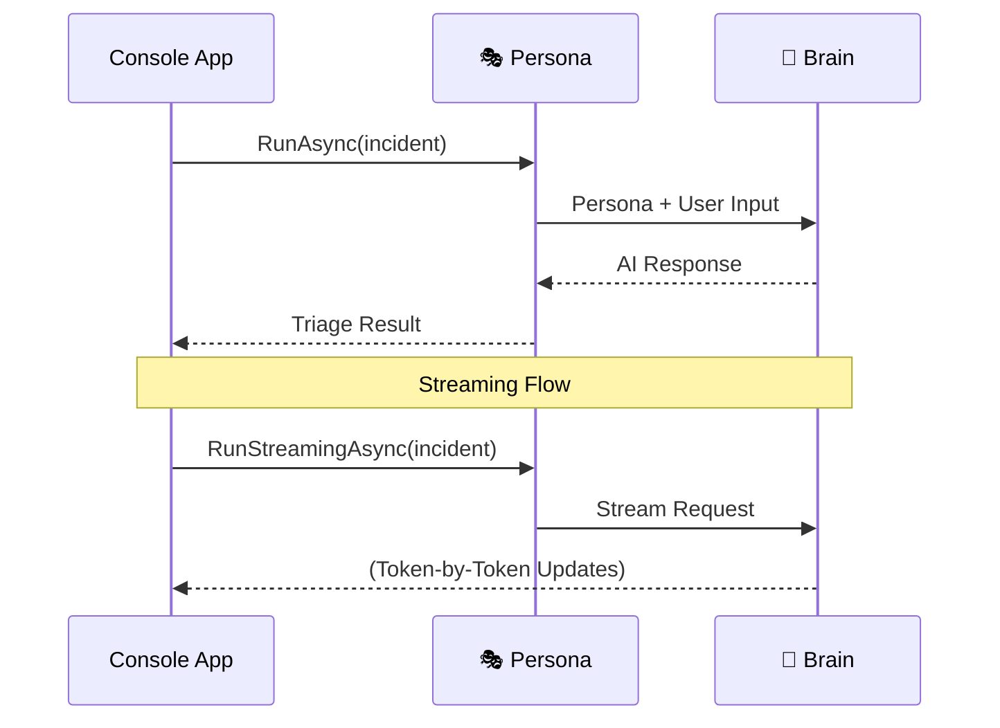

import Tabs from '../../../components/Tabs.astro';
import TabItem from '../../../components/TabItem.astro';

## Overview

Imagine you're **Jordan Miller**, a senior on-call engineer, and a flood of alerts just hit your inbox. You need an **agent** that can instantly summarize the chaos and suggest a severity level. This guide walks you through building that agent. Using the **Microsoft Agent Framework**, you'll create a triage assistant that connects to your infrastructure alerts and provides immediate, streamed analysis to help you respond faster.

## What is an AI Agent?

An AI Agent is more than just a chatbot. While a chatbot responds to messages, an **Agent** is a goal-oriented entity that uses reasoning to decide which actions to take to accomplish a task.

<div class="grid grid-cols-1 sm:grid-cols-2 lg:grid-cols-5 gap-4 my-10">
  {/* Persona (Active) */}
  <div class="p-5 rounded-2xl bg-white border-2 border-indigo-500 shadow-xl shadow-indigo-500/10 transition-all hover:-translate-y-1 relative overflow-hidden animate-fade-in">
    <div class="absolute top-0 right-0 px-2 py-0.5 bg-indigo-500 text-[9px] font-black text-white rounded-bl-lg tracking-tighter uppercase">Building</div>
    <div class="w-10 h-10 rounded-xl bg-indigo-50 flex items-center justify-center text-xl mb-4 border border-indigo-100">🎭</div>
    <div class="font-bold text-slate-900 mb-1 text-sm">Persona</div>
    <p class="text-[11px] leading-relaxed text-slate-600 font-medium">Jordan's on-call identity.</p>
  </div>

  {/* Brain (Active) */}
  <div class="p-5 rounded-2xl bg-white border-2 border-indigo-500 shadow-xl shadow-indigo-500/10 transition-all hover:-translate-y-1 relative overflow-hidden animate-fade-in animate-delay-1">
    <div class="absolute top-0 right-0 px-2 py-0.5 bg-indigo-500 text-[9px] font-black text-white rounded-bl-lg tracking-tighter uppercase">Building</div>
    <div class="w-10 h-10 rounded-xl bg-indigo-50 flex items-center justify-center text-xl mb-4 border border-indigo-100">🧠</div>
    <div class="font-bold text-slate-900 mb-1 text-sm">Brain</div>
    <p class="text-[11px] leading-relaxed text-slate-600 font-medium">Reasoning about alerts.</p>
  </div>

  {/* Tools (Upcoming) */}
  <div class="p-5 rounded-2xl bg-slate-50/50 border border-slate-200/60 shadow-sm opacity-50 grayscale transition-all hover:grayscale-0 hover:opacity-100 animate-fade-in animate-delay-2">
    <div class="absolute top-0 right-0 px-2 py-0.5 bg-amber-500 text-[9px] font-black text-white rounded-bl-lg tracking-tighter uppercase">Upcoming</div>
    <div class="w-10 h-10 rounded-xl bg-white shadow-sm flex items-center justify-center text-xl mb-4 border border-slate-100">🛠️</div>
    <div class="font-bold text-slate-900 mb-1 text-sm">Tools</div>
    <p class="text-[11px] leading-relaxed text-slate-500">External capabilities.</p>
  </div>

  {/* Memory (Upcoming) */}
  <div class="p-5 rounded-2xl bg-slate-50/50 border border-slate-200/60 shadow-sm opacity-50 grayscale transition-all hover:grayscale-0 hover:opacity-100 animate-fade-in animate-delay-3">
    <div class="absolute top-0 right-0 px-2 py-0.5 bg-slate-400 text-[9px] font-black text-white rounded-bl-lg tracking-tighter uppercase">Upcoming</div>
    <div class="w-10 h-10 rounded-xl bg-white shadow-sm flex items-center justify-center text-xl mb-4 border border-slate-100">💾</div>
    <div class="font-bold text-slate-900 mb-1 text-sm">Memory</div>
    <p class="text-[11px] leading-relaxed text-slate-500">State and history.</p>
  </div>

  {/* Hosting (Upcoming) */}
  <div class="p-5 rounded-2xl bg-slate-50/50 border border-slate-200/60 shadow-sm opacity-50 grayscale transition-all hover:grayscale-0 hover:opacity-100 animate-fade-in animate-delay-4">
    <div class="absolute top-0 right-0 px-2 py-0.5 bg-slate-400 text-[9px] font-black text-white rounded-bl-lg tracking-tighter uppercase">Upcoming</div>
    <div class="w-10 h-10 rounded-xl bg-white shadow-sm flex items-center justify-center text-xl mb-4 border border-slate-100">☁️</div>
    <div class="font-bold text-slate-900 mb-1 text-sm">Hosting</div>
    <p class="text-[11px] leading-relaxed text-slate-500">Exposing as a service.</p>
  </div>
</div>

<div class="premium-gradient border border-indigo-100 rounded-3xl p-8 my-12 shadow-sm relative overflow-hidden animate-fade-in animate-delay-4">
  <div class="absolute -top-10 -right-10 w-40 h-40 bg-indigo-500/5 rounded-full blur-3xl"></div>
  <div class="flex gap-5 relative z-10">
    <div class="flex-shrink-0 w-12 h-12 rounded-2xl bg-indigo-600 flex items-center justify-center text-white shadow-lg shadow-indigo-200">
      <svg xmlns="http://www.w3.org/2000/svg" width="24" height="24" viewBox="0 0 24 24" fill="none" stroke="currentColor" stroke-width="2.5" stroke-linecap="round" stroke-linejoin="round"><path d="M2 3h6a4 4 0 0 1 4 4v14a3 3 0 0 0-3-3H2z"/><path d="M22 3h-6a4 4 0 0 0-4 4v14a3 3 0 0 1 3-3h7z"/></svg>
    </div>
    <div>
      <h4 class="text-indigo-950 font-black text-lg tracking-tight mb-2">The Power of Streaming</h4>
      <p class="text-sm leading-relaxed text-indigo-900/70 max-w-2xl">
        In a critical incident, every second counts. Traditional AI interactions wait for the entire response to be generated before showing it to you. By using **Streaming**, Jordan's assistant provides immediate feedback, allowing you to begin reading the analysis while the model is still "thinking" about the next steps.
      </p>
    </div>
  </div>
</div>

## Setup your environment

Before we write any code, let's make sure your environment is ready.

<div class="solid-callout solid-callout-info mb-8">
  <p class="font-bold text-indigo-900 mb-3 text-base">📋 Pre-flight Checklist</p>
  <ul class="space-y-2.5 m-0 p-0 list-none text-sm text-indigo-900/80">
    <li class="flex items-center gap-2">🛠️ **.NET 10.0 SDK** (or later) installed.</li>
    <li class="flex items-center gap-2">🤖 **AI Provider**: Access to Azure OpenAI or a locally hosted OpenAI-compatible service (like Ollama/LM Studio).</li>
    <li class="flex items-center gap-2">🔑 **Authentication**: An active Azure session (`az login`) or required API keys.</li>
  </ul>
</div>

### <span class="step-pill">1</span> Create the project
Open your terminal and create a new console application:

```bash
dotnet new console -n IncidentTriage.HelloAgent -f net10.0
cd IncidentTriage.HelloAgent
```

### <span class="step-pill">2</span> Install the Agent Framework
Next, install the core framework and the provider SDK for your chosen model. 

<Tabs syncKey="provider">
  <TabItem label="OpenAI Compatible (LM Studio)">
```bash
dotnet add package Microsoft.Agents.AI.OpenAI
dotnet add package OpenAI
dotnet restore
```

<div class="flex items-center gap-3 my-6 opacity-50">
  <div class="h-[1px] flex-1 bg-slate-200"></div>
  <span class="text-[10px] font-black uppercase tracking-widest text-slate-400">Package Anatomy</span>
  <div class="h-[1px] flex-1 bg-slate-200"></div>
</div>

  <div class="grid grid-cols-1 md:grid-cols-2 gap-4 mb-6">
    <div class="p-4 rounded-xl border border-slate-200 bg-white shadow-sm hover:border-indigo-200 hover:shadow-md transition-all">
      <div class="flex items-center gap-2 mb-2">
        <span class="text-xl">🔌</span>
        <code class="text-xs font-bold text-indigo-600">Microsoft.Agents.AI.OpenAI</code>
      </div>
      <p class="text-xs text-slate-500 leading-relaxed">The core bridge that connects the Agent Framework to OpenAI-compatible models.</p>
    </div>
    <div class="p-4 rounded-xl border border-slate-200 bg-white shadow-sm hover:border-indigo-200 hover:shadow-md transition-all">
      <div class="flex items-center gap-2 mb-2">
        <span class="text-xl">🤖</span>
        <code class="text-xs font-bold text-indigo-600">OpenAI</code>
      </div>
      <p class="text-xs text-slate-500 leading-relaxed">The official SDK for standard OpenAI REST API interactions and streaming.</p>
    </div>
  </div>
  </TabItem>
  <TabItem label="Azure OpenAI">
```bash
dotnet add package Microsoft.Agents.AI.OpenAI
dotnet add package Azure.AI.OpenAI
dotnet add package Azure.Identity
dotnet restore
```

<div class="flex items-center gap-3 my-6 opacity-50">
  <div class="h-[1px] flex-1 bg-slate-200"></div>
  <span class="text-[10px] font-black uppercase tracking-widest text-slate-400">Package Anatomy</span>
  <div class="h-[1px] flex-1 bg-slate-200"></div>
</div>

  <div class="grid grid-cols-1 md:grid-cols-3 gap-4 mb-6">
    <div class="p-4 rounded-xl border border-slate-200 bg-white shadow-sm hover:border-indigo-200 hover:shadow-md transition-all">
      <div class="flex items-center gap-2 mb-2">
        <span class="text-xl">🔌</span>
        <code class="text-xs font-bold text-indigo-600">Microsoft.Agents.AI.OpenAI</code>
      </div>
      <p class="text-xs text-slate-500 leading-relaxed">The core bridge that connects the Agent Framework to OpenAI-compatible models.</p>
    </div>
    <div class="p-4 rounded-xl border border-slate-200 bg-white shadow-sm hover:border-indigo-200 hover:shadow-md transition-all">
      <div class="flex items-center gap-2 mb-2">
        <span class="text-xl">☁️</span>
        <code class="text-xs font-bold text-indigo-600">Azure.AI.OpenAI</code>
      </div>
      <p class="text-xs text-slate-500 leading-relaxed">The official SDK for accessing GPT-4o and text embeddings within Azure.</p>
    </div>
    <div class="p-4 rounded-xl border border-slate-200 bg-white shadow-sm hover:border-indigo-200 hover:shadow-md transition-all">
      <div class="flex items-center gap-2 mb-2">
        <span class="text-xl">🔐</span>
        <code class="text-xs font-bold text-indigo-600">Azure.Identity</code>
      </div>
      <p class="text-xs text-slate-500 leading-relaxed">Enables secure, passwordless authentication using Azure CLI or Managed Identity.</p>
    </div>
  </div>
  </TabItem>
</Tabs>

### <span class="step-pill">3</span> Configure your provider
Finally, set the environment variables for your chosen provider. In your terminal, use `export` (Bash/macOS) or `$env:VAR="value"` (PowerShell/Windows).

<Tabs syncKey="provider">
  <TabItem label="OpenAI Compatible (LM Studio)">
  **Required Variables:**
  - `OPENAI_ENDPOINT="http://localhost:1234/v1"`
  - `OPENAI_MODEL_NAME="<your-model-name>"`

  <div class="solid-callout solid-callout-info my-6">
    <p class="font-bold text-indigo-900 mb-2 text-sm">🖥️ LM Studio Quick Start</p>
    <ol class="space-y-1.5 m-0 p-0 list-decimal list-inside text-xs text-indigo-900/80">
      <li>Download and open **LM Studio**.</li>
      <li>Search for and download a model (e.g., `google/gemma-4-e4b`).</li>
      <li>Go to the **Local Server** tab and click **Start Server**.</li>
      <li>Ensure the endpoint matches: `http://localhost:1234/v1`.</li>
    </ol>
  </div>

  > **Using Ollama?** Use `http://localhost:11434/v1` as your endpoint and ensure you have run `ollama pull <model>` first.
  </TabItem>
  <TabItem label="Azure OpenAI">
  **Required Variables:**
  - `AZURE_OPENAI_ENDPOINT="https://<your-resource>.openai.azure.com/"`
  - `AZURE_OPENAI_DEPLOYMENT_NAME="<your-deployment>"`

  > **Troubleshooting:**
  > - If authentication fails, ensure you are signed in (`az login`) with the correct tenant.
  > - If you receive a model not found error, confirm your deployment name is correct.
  </TabItem>
</Tabs>

## Build the agent

Building an agent involves three main parts: identifying the model provider, defining the agent's persona, and executing the task. 



This diagram illustrates the **interaction flow** we are about to implement. We will follow this pattern in three clear steps: configuring the agent's persona, providing the incident data, and finally, executing the triage.

Open `Program.cs` in your editor and let's build it piece by piece.

### <span class="step-pill">1</span> Initialize the Provider and Persona <div class="inline-flex items-center gap-1.5 px-2 py-0.5 rounded-md bg-indigo-50 border border-indigo-100 text-[10px] font-bold text-indigo-600 ml-2 uppercase tracking-tight">🎭 Persona</div> <div class="inline-flex items-center gap-1.5 px-2 py-0.5 rounded-md bg-indigo-50 border border-indigo-100 text-[10px] font-bold text-indigo-600 ml-1 uppercase tracking-tight">🧠 Brain</div>
First, we set up the connection to the AI model. 

*   **The Provider:** We pull endpoints and model names from environment variables to keep infrastructure details out of our source code.
*   **The Persona:** We use `instructions` to define the agent's **Persona**. This is known as the **System Prompt**, and it defines how the agent should behave globally.

Paste the initialization code for your chosen provider into `Program.cs`:

<Tabs syncKey="provider">
  <TabItem label="OpenAI Compatible (LM Studio)">
```csharp
  using OpenAI;
  using System.ClientModel;
  using Microsoft.Agents.AI;
  using OpenAI.Chat;

  // 1. Pull configuration from environment (or use local defaults)
  var endpoint = Environment.GetEnvironmentVariable("OPENAI_ENDPOINT") 
      ?? "http://localhost:1234/v1";
  var modelName = Environment.GetEnvironmentVariable("OPENAI_MODEL_NAME") 
      ?? "google/gemma-4-e4b";
  var apiKey = Environment.GetEnvironmentVariable("OPENAI_API_KEY") 
      ?? "dummy-key";

  // 2. Build the client and "imbue" the agent with a persona
  var chatClient = new OpenAIClient(new ApiKeyCredential(apiKey), new OpenAIClientOptions { Endpoint = new Uri(endpoint) })
      .GetChatClient(modelName);
  
  AIAgent agent = chatClient.AsAIAgent(new ChatClientAgentOptions
  {
      Name = "TriageAgent",
      ChatOptions = new()
      {
          Instructions = """
          You are an enterprise incident triage assistant.
          Summarize the incident, identify likely severity, 
          and suggest the next investigation step.
          Keep answers concise and operational.
          """
      }
  });
```
  </TabItem>
  <TabItem label="Azure OpenAI">
```csharp
  using Azure.AI.OpenAI;
  using Azure.Identity;
  using Microsoft.Agents.AI;

  // 1. Pull configuration from environment
  var endpoint = Environment.GetEnvironmentVariable("AZURE_OPENAI_ENDPOINT")
      ?? throw new InvalidOperationException(
          "AZURE_OPENAI_ENDPOINT is not set.");
  
  var deploymentName = Environment.GetEnvironmentVariable("AZURE_OPENAI_DEPLOYMENT_NAME") 
      ?? throw new InvalidOperationException(
          "AZURE_OPENAI_DEPLOYMENT_NAME is not set.");

  // 2. Build the client and "imbue" the agent with a persona
  var chatClient = new AzureOpenAIClient(new Uri(endpoint), new DefaultAzureCredential())
      .GetChatClient(deploymentName);

  AIAgent agent = chatClient.AsAIAgent(new ChatClientAgentOptions
  {
      Name = "TriageAgent",
      ChatOptions = new()
      {
          Instructions = """
          You are an enterprise incident triage assistant.
          Summarize the incident, identify likely severity, 
          and suggest the next investigation step.
          Keep answers concise and operational.
          """
      }
  });
```
  </TabItem>
</Tabs>

### <span class="step-pill">2</span> Define the Task
Next, we define the **User Input**. This is the specific data or query you want the agent to process—in this case, an active incident alert.

Append the incident data to `Program.cs`:

```csharp
var incident = """
Checkout latency is above threshold in West Europe.
The alert started 12 minutes ago and customer support is reporting failed payment attempts.
""";
```

### <span class="step-pill">3</span> Run and Stream the Response
Finally, we engage the **Brain** by invoking the agent. We will run it twice: first to receive a complete response, and then again using **Streaming**. Streaming prints characters as they are generated by the model, providing a much more responsive experience for the user.

Append the execution logic to the bottom of `Program.cs`:

```csharp
Console.WriteLine("Full response:");
Console.WriteLine(await agent.RunAsync(incident));

Console.WriteLine("\nStreaming response:");
await foreach (var update in agent.RunStreamingAsync(incident))
{
    Console.Write(update);
}
Console.WriteLine();
```

With everything in place, execute the application from your terminal:

```bash
dotnet run
```

You will see the full response printed first, followed immediately by a second response that streams character by character as it arrives from the model service.


## Try it

To see how the agent adapts, try modifying the variables in `Program.cs` and running the app again. Choose an experiment below to see how a small change impacts the agent's behavior:

<Tabs syncKey="experiment">
  <TabItem label="🎯 Instructions">
    ### Refine the Format
    Agents are highly sensitive to formatting constraints. Update the `instructions` parameter in your `AsAIAgent` builder:
    
    ```csharp
    instructions: """
    You are an enterprise incident triage assistant.
    Summarize the incident and identify likely severity.
    Provide your response as a concise, bulleted checklist for an on-call engineer.
    """,
    ```
    
    **Result:** The agent will shift from conversational prose to a structured, operational summary.
  </TabItem>

  <TabItem label="📟 Scenario">
    ### Test New Data
    Verify the agent's reasoning by swapping the `incident` string for a different failure:
    
    ```csharp
    var incident = """
    CRITICAL: Database connection timeout in the East US region. 
    Affecting 15% of login attempts. Latency is spiking.
    """;
    ```
    
    **Result:** The agent will pivot its severity assessment and suggest database-specific steps like checking connection pools.
  </TabItem>

  <TabItem label="🎭 Persona">
    ### Shift the Tone
    An agent's behavior is dictated by its persona. Change the `instructions` to a Senior SRE:
    
    ```csharp
    instructions: """
    You are a senior Site Reliability Engineer (SRE). 
    Be extremely technical and focus on infrastructure-level root causes.
    """,
    ```
    
    **Result:** The tone shifts to "technical expert," with next steps focusing on load balancers, logs, and system metrics.
  </TabItem>
</Tabs>

## Summary and Next Steps

You learned how to securely configure and connect an Agent Framework agent to an LLM provider, and successfully built a minimal incident triage agent that processes static prompts and streams its responses.

**Right now, our agent is disconnected from reality.** If we ask it about a specific server outage or a database error, it will guess an answer based on its general training data, because it cannot actually *see* the current status of our enterprise systems. An incident triage agent isn't very helpful if it cannot look up real incident details.

In the **[next tutorial](/learn/agent-essentials/add-tools)**, we will solve this by giving our agent **Tools**. We will create a plugin that connects to an external API, allowing our agent to fetch real-time ticket information and provide grounded, accurate triage responses.
