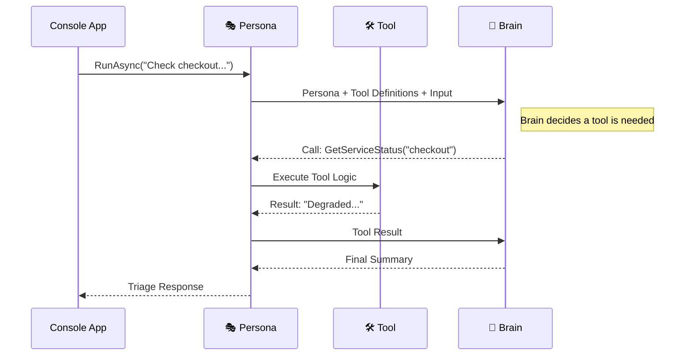

import Tabs from '../../../components/Tabs.astro';
import TabItem from '../../../components/TabItem.astro';

## Overview

In the previous tutorial, **Jordan Miller** built a triage assistant that could summarize an incident alert. However, it was limited to the information provided in the prompt. In a real-world scenario, Jordan needs an agent that can **act**—one that can look up the actual status of a service or query a database to see if a deployment recently failed.

This guide walks you through giving the agent **Tools**. You'll expose a C# method as an agent capability, allowing Jordan's assistant to fetch real-time health data before providing a response. This process is called **Grounding**, as it ensures the agent's answers are based on facts rather than just model predictions.

## Agent Anatomy

An AI Agent uses **Tools** to interact with the world. While the **Brain** (LLM) decides what to do, the **Tools** are the hands that execute the work.

<div class="grid grid-cols-1 sm:grid-cols-2 lg:grid-cols-5 gap-4 my-10">
  {/* Persona (Mastered) */}
  <div class="p-5 rounded-2xl bg-slate-50/50 border border-slate-200/60 shadow-sm opacity-50 grayscale transition-all hover:grayscale-0 hover:opacity-100 animate-fade-in">
    <div class="w-10 h-10 rounded-xl bg-white shadow-sm flex items-center justify-center text-xl mb-4 border border-slate-100">🎭</div>
    <div class="font-bold text-slate-900 mb-1 text-sm">Persona</div>
    <p class="text-[11px] leading-relaxed text-slate-500">Jordan's on-call identity.</p>
  </div>

  {/* Brain (Mastered) */}
  <div class="p-5 rounded-2xl bg-slate-50/50 border border-slate-200/60 shadow-sm opacity-50 grayscale transition-all hover:grayscale-0 hover:opacity-100 animate-fade-in animate-delay-1">
    <div class="w-10 h-10 rounded-xl bg-white shadow-sm flex items-center justify-center text-xl mb-4 border border-slate-100">🧠</div>
    <div class="font-bold text-slate-900 mb-1 text-sm">Brain</div>
    <p class="text-[11px] leading-relaxed text-slate-500">Reasoning about alerts.</p>
  </div>

  {/* Tools (Active) */}
  <div class="p-5 rounded-2xl bg-white border-2 border-indigo-500 shadow-xl shadow-indigo-500/10 transition-all hover:-translate-y-1 relative overflow-hidden animate-fade-in animate-delay-2">
    <div class="absolute top-0 right-0 px-2 py-0.5 bg-indigo-500 text-[9px] font-black text-white rounded-bl-lg tracking-tighter uppercase">Building</div>
    <div class="w-10 h-10 rounded-xl bg-indigo-50 flex items-center justify-center text-xl mb-4 border border-indigo-100">🛠️</div>
    <div class="font-bold text-slate-900 mb-1 text-sm">Tools</div>
    <p class="text-[11px] leading-relaxed text-slate-600 font-medium">External capabilities.</p>
  </div>

  {/* Memory (Upcoming) */}
  <div class="p-5 rounded-2xl bg-slate-50/50 border border-slate-200/60 shadow-sm opacity-50 grayscale transition-all hover:grayscale-0 hover:opacity-100 animate-fade-in animate-delay-3">
    <div class="absolute top-0 right-0 px-2 py-0.5 bg-amber-500 text-[9px] font-black text-white rounded-bl-lg tracking-tighter uppercase">Upcoming</div>
    <div class="w-10 h-10 rounded-xl bg-white shadow-sm flex items-center justify-center text-xl mb-4 border border-slate-100">💾</div>
    <div class="font-bold text-slate-900 mb-1 text-sm">Memory</div>
    <p class="text-[11px] leading-relaxed text-slate-500">State and history.</p>
  </div>

  {/* Hosting (Upcoming) */}
  <div class="p-5 rounded-2xl bg-slate-50/50 border border-slate-200/60 shadow-sm opacity-50 grayscale transition-all hover:grayscale-0 hover:opacity-100 animate-fade-in animate-delay-4">
    <div class="absolute top-0 right-0 px-2 py-0.5 bg-slate-400 text-[9px] font-black text-white rounded-bl-lg tracking-tighter uppercase">Upcoming</div>
    <div class="w-10 h-10 rounded-xl bg-white shadow-sm flex items-center justify-center text-xl mb-4 border border-slate-100">☁️</div>
    <div class="font-bold text-slate-900 mb-1 text-sm">Hosting</div>
    <p class="text-[11px] leading-relaxed text-slate-500">Exposing as a service.</p>
  </div>
</div>

<div class="premium-gradient border border-indigo-100 rounded-3xl p-8 my-12 shadow-sm relative overflow-hidden animate-fade-in animate-delay-4">
  <div class="absolute -top-10 -right-10 w-40 h-40 bg-indigo-500/5 rounded-full blur-3xl"></div>
  <div class="flex gap-5 relative z-10">
    <div class="flex-shrink-0 w-12 h-12 rounded-2xl bg-indigo-600 flex items-center justify-center text-white shadow-lg shadow-indigo-200">
      <svg xmlns="http://www.w3.org/2000/svg" width="24" height="24" viewBox="0 0 24 24" fill="none" stroke="currentColor" stroke-width="2.5" stroke-linecap="round" stroke-linejoin="round"><path d="M2 3h6a4 4 0 0 1 4 4v14a3 3 0 0 0-3-3H2z"/><path d="M22 3h-6a4 4 0 0 0-4 4v14a3 3 0 0 1 3-3h7z"/></svg>
    </div>
    <div>
      <h4 class="text-indigo-950 font-black text-lg tracking-tight mb-2">Grounding vs. Hallucination</h4>
      <p class="text-sm leading-relaxed text-indigo-900/70 max-w-2xl">
        LLMs are probabilistic, meaning they might "hallucinate" or guess facts if they aren't sure. By giving Jordan's agent **Tools**, you are providing it with a "source of truth." This ensures the agent's responses are **grounded** in actual system data rather than just likely-sounding predictions.
      </p>
    </div>
  </div>
</div>

## Setup your environment

If you are continuing from the previous tutorial, you can use your existing project. Otherwise, follow the steps below to initialize a new one.

<div class="solid-callout solid-callout-info mb-8">
  <p class="font-bold text-indigo-900 mb-3 text-base">📋 Pre-flight Checklist</p>
  <ul class="space-y-2.5 m-0 p-0 list-none text-sm text-indigo-900/80">
    <li class="flex items-center gap-2">🛠️ **.NET 10.0 SDK** (or later) installed.</li>
    <li class="flex items-center gap-2">🤖 **AI Provider**: Access to Azure OpenAI or a local service (Ollama/LM Studio).</li>
    <li class="flex items-center gap-2">📦 **Microsoft.Extensions.AI**: We will use this for standard AI function metadata.</li>
  </ul>
</div>

### <span class="step-pill">1</span> Install required packages
If you are continuing from the previous tutorial, you've already installed the core Agent Framework and provider SDKs. In this module, we focus on the new package needed for describing our tools to the LLM.

<Tabs syncKey="provider">
  <TabItem label="OpenAI Compatible (LM Studio)">
```bash
dotnet add package Microsoft.Agents.AI.OpenAI
dotnet add package OpenAI
dotnet add package Microsoft.Extensions.AI
dotnet restore
```

<div class="flex items-center gap-3 my-6 opacity-50">
  <div class="h-[1px] flex-1 bg-slate-200"></div>
  <span class="text-[10px] font-black uppercase tracking-widest text-slate-400">Package Anatomy</span>
  <div class="h-[1px] flex-1 bg-slate-200"></div>
</div>

<div class="grid grid-cols-1 md:grid-cols-3 gap-4 mb-6">
  <div class="p-4 rounded-xl border border-slate-200 bg-white shadow-sm hover:border-indigo-200 hover:shadow-md transition-all">
    <div class="flex items-center gap-2 mb-2">
      <span class="text-xl">🔌</span>
      <code class="text-xs font-bold text-indigo-600">Microsoft.Agents.AI.OpenAI</code>
    </div>
    <p class="text-xs text-slate-500 leading-relaxed">The core bridge that connects the Agent Framework to OpenAI-compatible models.</p>
  </div>
  <div class="p-4 rounded-xl border border-slate-200 bg-white shadow-sm hover:border-indigo-200 hover:shadow-md transition-all">
    <div class="flex items-center gap-2 mb-2">
      <span class="text-xl">🤖</span>
      <code class="text-xs font-bold text-indigo-600">OpenAI</code>
    </div>
    <p class="text-xs text-slate-500 leading-relaxed">The official SDK for standard OpenAI REST API interactions and streaming.</p>
  </div>
  <div class="p-4 rounded-xl border border-slate-200 bg-white shadow-sm hover:border-indigo-200 hover:shadow-md transition-all">
    <div class="flex items-center gap-2 mb-2">
      <span class="text-xl">🛠️</span>
      <code class="text-xs font-bold text-indigo-600">Microsoft.Extensions.AI</code>
    </div>
    <p class="text-xs text-slate-500 leading-relaxed">Provides the unified .NET abstractions for AI. We use its attributes to describe our tools so the LLM can understand them.</p>
  </div>
</div>
  </TabItem>
  <TabItem label="Azure OpenAI">
```bash
dotnet add package Microsoft.Agents.AI.OpenAI
dotnet add package Azure.AI.OpenAI
dotnet add package Microsoft.Extensions.AI
dotnet restore
```

<div class="flex items-center gap-3 my-6 opacity-50">
  <div class="h-[1px] flex-1 bg-slate-200"></div>
  <span class="text-[10px] font-black uppercase tracking-widest text-slate-400">Package Anatomy</span>
  <div class="h-[1px] flex-1 bg-slate-200"></div>
</div>

<div class="grid grid-cols-1 md:grid-cols-3 gap-4 mb-6">
  <div class="p-4 rounded-xl border border-slate-200 bg-white shadow-sm hover:border-indigo-200 hover:shadow-md transition-all">
    <div class="flex items-center gap-2 mb-2">
      <span class="text-xl">🔌</span>
      <code class="text-xs font-bold text-indigo-600">Microsoft.Agents.AI.OpenAI</code>
    </div>
    <p class="text-xs text-slate-500 leading-relaxed">The core bridge that connects the Agent Framework to OpenAI-compatible models.</p>
  </div>
  <div class="p-4 rounded-xl border border-slate-200 bg-white shadow-sm hover:border-indigo-200 hover:shadow-md transition-all">
    <div class="flex items-center gap-2 mb-2">
      <span class="text-xl">☁️</span>
      <code class="text-xs font-bold text-indigo-600">Azure.AI.OpenAI</code>
    </div>
    <p class="text-xs text-slate-500 leading-relaxed">The official SDK for accessing GPT-4o and text embeddings within Azure.</p>
  </div>
  <div class="p-4 rounded-xl border border-slate-200 bg-white shadow-sm hover:border-indigo-200 hover:shadow-md transition-all">
    <div class="flex items-center gap-2 mb-2">
      <span class="text-xl">🛠️</span>
      <code class="text-xs font-bold text-indigo-600">Microsoft.Extensions.AI</code>
    </div>
    <p class="text-xs text-slate-500 leading-relaxed">Provides the unified .NET abstractions for AI. We use its attributes to describe our tools so the LLM can understand them.</p>
  </div>
</div>
  </TabItem>
</Tabs>

---

## Build the agent

We will now define a C# method that simulates a service health check and register it as a tool for our agent.



### <span class="step-pill">1</span> Implement the Agent and Tools <div class="inline-flex items-center gap-1.5 px-2 py-0.5 rounded-md bg-indigo-50 border border-indigo-100 text-[10px] font-bold text-indigo-600 ml-2 uppercase tracking-tight">🎭 Persona</div> <div class="inline-flex items-center gap-1.5 px-2 py-0.5 rounded-md bg-indigo-50 border border-indigo-100 text-[10px] font-bold text-indigo-600 ml-1 uppercase tracking-tight">🛠️ Tools</div>
We define a standard C# method and use `[Description]` (from `System.ComponentModel`) to provide the "semantic map" the LLM needs to understand what our tool does. 

We will now combine everything into a complete program. This includes the `using` statements, the tool definition with metadata, the agent initialization, and the execution loop.

Replace the contents of `Program.cs` with the code for your provider:

<Tabs syncKey="provider">
  <TabItem label="OpenAI Compatible (LM Studio)">
```csharp
using System.ComponentModel;
using OpenAI;
using System.ClientModel;
using Microsoft.Agents.AI;
using Microsoft.Extensions.AI;
using OpenAI.Chat;

// 1. Configure the Provider
var endpoint = Environment.GetEnvironmentVariable("OPENAI_ENDPOINT") ?? "http://localhost:1234/v1";
var modelName = Environment.GetEnvironmentVariable("OPENAI_MODEL_NAME") ?? "google/gemma-4-e4b";
var chatClient = new OpenAIClient(new ApiKeyCredential("dummy"), new OpenAIClientOptions { Endpoint = new Uri(endpoint) })
    .GetChatClient(modelName);

// 2. Define the Tool
[Description("Gets the current health status for an enterprise service.")]
static string GetServiceStatus(
    [Description("The service name to check, such as checkout, payments, or inventory.")] string serviceName)
{
    return serviceName.ToLowerInvariant() switch
    {
        "checkout" => "Checkout is DEGRADED in West Europe. P P95 latency is 4.8s. Payment retries are elevated.",
        "payments" => "Payments is HEALTHY. No active regional alerts.",
        "inventory" => "Inventory is HEALTHY. Last sync 2 minutes ago.",
        _ => $"{serviceName} has no active status record in the demo store."
    };
}

// 3. Initialize the Agent with the Tool

AIAgent agent = chatClient.AsAIAgent(new ChatClientAgentOptions
{
    Name = "TriageAgent",
    ChatOptions = new()
    {
        Instructions = """
        You are an enterprise incident triage assistant.
        Summarize the incident, identify likely severity, 
        and suggest the next investigation step.

        IMPORTANT:
        - You MUST use the provided service status tools to verify the health of any service mentioned in the incident.
        - Do NOT guess the status of a service. 
        - Always base your triage on the grounded data returned by your tools.

        Keep answers concise and operational.
        """,
        Tools = [AIFunctionFactory.Create(GetServiceStatus, "GetServiceStatus")]
    }
});

// 4. Define the Task
var incident = """
We have reports of checkout failures. 
Can you check the status of the checkout service and summarize the impact?
""";

// 5. Run and Stream
Console.WriteLine("Agent reasoning and responding...");
await foreach (var update in agent.RunStreamingAsync(incident))
{
    Console.Write(update);
}
Console.WriteLine();
```
  </TabItem>
  <TabItem label="Azure OpenAI">
```csharp
using System.ComponentModel;
using Azure.AI.OpenAI;
using Azure.Identity;
using Microsoft.Agents.AI;
using Microsoft.Extensions.AI;
using OpenAI.Chat;

// 1. Configure the Provider
var endpoint = Environment.GetEnvironmentVariable("AZURE_OPENAI_ENDPOINT")!;
var deploymentName = Environment.GetEnvironmentVariable("AZURE_OPENAI_DEPLOYMENT_NAME")!;

// 2. Define the Tool
[Description("Gets the current health status for an enterprise service.")]
static string GetServiceStatus(
    [Description("The service name to check, such as checkout, payments, or inventory.")] string serviceName)
{
    return serviceName.ToLowerInvariant() switch
    {
        "checkout" => "Checkout is DEGRADED in West Europe. P95 latency is 4.8s. Payment retries are elevated.",
        "payments" => "Payments is HEALTHY. No active regional alerts.",
        "inventory" => "Inventory is HEALTHY. Last sync 2 minutes ago.",
        _ => $"{serviceName} has no active status record in the demo store."
    };
}

// 3. Initialize the Agent with the Tool
var chatClient = new AzureOpenAIClient(new Uri(endpoint), new DefaultAzureCredential())
    .GetChatClient(deploymentName);

AIAgent agent = chatClient.AsAIAgent(new ChatClientAgentOptions
{
    Name = "TriageAgent",
    ChatOptions = new()
    {
        Instructions = """
        You are an enterprise incident triage assistant.
        Summarize the incident, identify likely severity, 
        and suggest the next investigation step.

        IMPORTANT:
        - You MUST use the provided service status tools to verify the health of any service mentioned in the incident.
        - Do NOT guess the status of a service. 
        - Always base your triage on the grounded data returned by your tools.

        Keep answers concise and operational.
        """,
        Tools = [AIFunctionFactory.Create(GetServiceStatus, "GetServiceStatus")]
    }
});

// 4. Define the Task
var incident = """
We have reports of checkout failures. 
Can you check the status of the checkout service and summarize the impact?
""";

// 5. Run and Stream
Console.WriteLine("Agent reasoning and responding...");
await foreach (var update in agent.RunStreamingAsync(incident))
{
    Console.Write(update);
}
Console.WriteLine();
```
  </TabItem>
</Tabs>

With everything in place, execute the application from your terminal:

```bash
dotnet run
```

---

## Try it

Observe how the agent's behavior changes when you modify the "facts" available to it.

<Tabs syncKey="experiment">
  <TabItem label="🎯 New Capability">
    ### Add a New Tool
    Try adding a second tool to check the **On-Call Engineer** for a service.
    
    ```csharp
    [Description("Gets the name of the engineer currently on-call.")]
    static string GetOnCallEngineer(
        [Description("The service name to check.")] string serviceName) => "Taylor Vance (@tvance)";
    ```
    
    Update your `AsAIAgent` call to include it:
    
    ```csharp
    tools: [
        AIFunctionFactory.Create(GetServiceStatus,"GetServiceStatus"), 
        AIFunctionFactory.Create(GetOnCallEngineer,"GetOnCallEngineer")
    ]
    ```
    
    Update your `incident` string to ask for the on-call contact:
    
    ```csharp
    var incident = """
    Check checkout health and tell me who is on call.
    """;
    ```
    
    **Result:** The agent will now invoke both tools sequentially and mention Taylor Vance in its response.
  </TabItem>

  <TabItem label="📟 Fact Swap">
    ### Change the Status
    Update the logic in your `GetServiceStatus` method to return a healthy result for the checkout service:
    
    ```csharp
    "checkout" => "Checkout is HEALTHY. No active regional alerts.",
    ```
    
    Run the app again with the original `incident` query.
    
    **Result:** Instead of escalating, the agent will report that the internal status is healthy and suggest investigating client-side issues or load balancer configurations.
  </TabItem>

  <TabItem label="🎭 Proactive Persona">
    ### Automate Tool Usage
    You can force the agent to be proactive by updating the **Persona**. This ensures it always performs specific checks without being asked in every prompt.
    
    Update the `instructions` to mandate the contact check:
    
    ```csharp
    instructions: """
    You are a proactive SRE. 
    For every service mentioned, you MUST check both its health AND the currently on-call engineer.
    Always include the contact person in your summary.
    """
    ```
    
    **Revert your `incident` string to the simple version:**
    
    ```csharp
    var incident = "Check checkout status.";
    ```
    
    **Result:** Even without asking for the contact, the agent will automatically invoke both tools and provide the engineer's name because the Persona mandates it.
  </TabItem>
</Tabs>

## Summary and Next Steps

You've successfully bridged the gap between an LLM and your own C# logic! By using **Tools**, Jordan's assistant can now provide grounded, accurate responses based on real-time data from your environment.

**However, our agent still has a short memory.** Because we haven't implemented state management yet, the agent forgets everything the moment a turn ends. If you were to add a follow-up turn to your `Program.cs`, the agent would lose the context:

```csharp
// Turn 1: (Already implemented above)
// await foreach (var update in agent.RunStreamingAsync(incident)) { ... }

// Turn 2: (Add this follow-up)
Console.WriteLine(await agent.RunAsync("Who is on call for that?")); 

// Result: "I need to know which service you are referring to in order to tell you who the on-call engineer is."
```

In the **[next tutorial](/learn/agent-essentials/multi-turn)**, we will solve this by implementing **State Management**, allowing our agent to maintain a multi-turn conversation.
