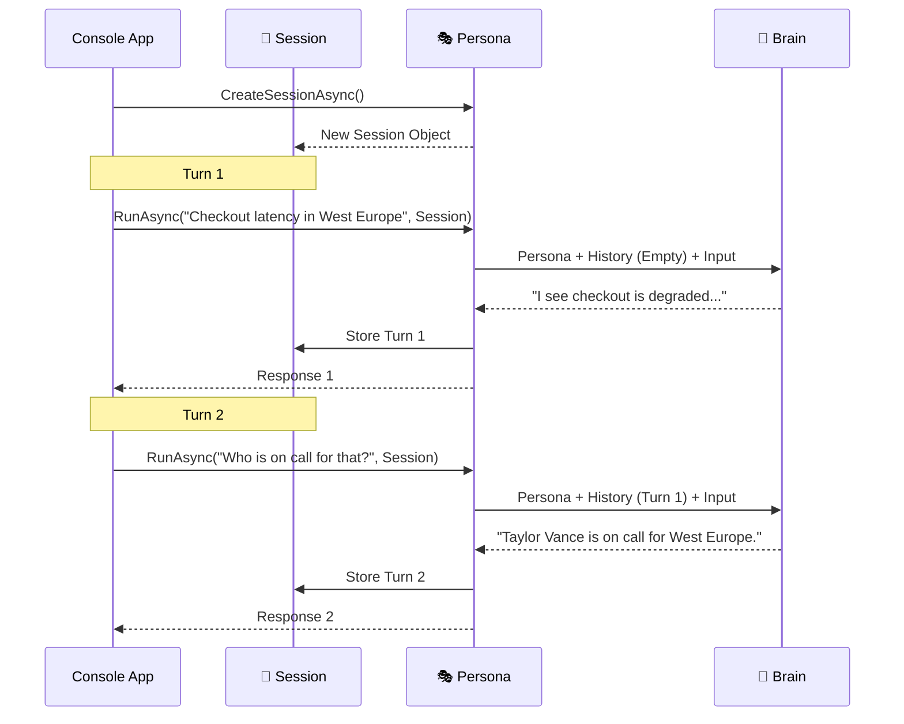

import Tabs from '../../../components/Tabs.astro';
import TabItem from '../../../components/TabItem.astro';

## Overview

In the previous tutorials, **Jordan Miller** built an agent that could use tools to check service health. However, each interaction was a "one-and-done" affair. If Jordan were to add a follow-up turn to the investigation, the agent would lose the context:

```csharp
// Turn 1: (Already implemented in Module 2)
// await foreach (var update in agent.RunStreamingAsync(incident)) { ... }

// Turn 2: (Add this follow-up)
Console.WriteLine(await agent.RunAsync("Who is on call for that?")); 

// Result: "I need to know which service you are referring to in order to tell you who the on-call engineer is."
```

In a high-pressure incident, Jordan needs to be able to iterate—asking for more details or refining a search without repeating the entire history. This guide walks you through implementing **Memory**. You'll use an **Agent Session** to preserve the conversation state, allowing Jordan's assistant to maintain context across multiple turns.

## Agent Anatomy

An AI Agent uses **Memory** to maintain a "thread" of conversation. Without it, every message is treated as the very first time the agent has ever met you.

<div class="grid grid-cols-1 sm:grid-cols-2 lg:grid-cols-5 gap-4 my-10">
  {/* Persona (Mastered) */}
  <div class="p-5 rounded-2xl bg-slate-50/50 border border-slate-200/60 shadow-sm opacity-50 grayscale transition-all hover:grayscale-0 hover:opacity-100 animate-fade-in">
    <div class="w-10 h-10 rounded-xl bg-white shadow-sm flex items-center justify-center text-xl mb-4 border border-slate-100">🎭</div>
    <div class="font-bold text-slate-900 mb-1 text-sm">Persona</div>
    <p class="text-[11px] leading-relaxed text-slate-500">Jordan's on-call identity.</p>
  </div>

  {/* Brain (Mastered) */}
  <div class="p-5 rounded-2xl bg-slate-50/50 border border-slate-200/60 shadow-sm opacity-50 grayscale transition-all hover:grayscale-0 hover:opacity-100 animate-fade-in animate-delay-1">
    <div class="w-10 h-10 rounded-xl bg-white shadow-sm flex items-center justify-center text-xl mb-4 border border-slate-100">🧠</div>
    <div class="font-bold text-slate-900 mb-1 text-sm">Brain</div>
    <p class="text-[11px] leading-relaxed text-slate-500">Reasoning about alerts.</p>
  </div>

  {/* Tools (Mastered) */}
  <div class="p-5 rounded-2xl bg-slate-50/50 border border-slate-200/60 shadow-sm opacity-50 grayscale transition-all hover:grayscale-0 hover:opacity-100 animate-fade-in animate-delay-2">
    <div class="w-10 h-10 rounded-xl bg-white shadow-sm flex items-center justify-center text-xl mb-4 border border-slate-100">🛠️</div>
    <div class="font-bold text-slate-900 mb-1 text-sm">Tools</div>
    <p class="text-[11px] leading-relaxed text-slate-500">External capabilities.</p>
  </div>

  {/* Memory (Active) */}
  <div class="p-5 rounded-2xl bg-white border-2 border-indigo-500 shadow-xl shadow-indigo-500/10 transition-all hover:-translate-y-1 relative overflow-hidden animate-fade-in animate-delay-3">
    <div class="absolute top-0 right-0 px-2 py-0.5 bg-indigo-500 text-[9px] font-black text-white rounded-bl-lg tracking-tighter uppercase">Building</div>
    <div class="w-10 h-10 rounded-xl bg-indigo-50 flex items-center justify-center text-xl mb-4 border border-indigo-100">💾</div>
    <div class="font-bold text-slate-900 mb-1 text-sm">Memory</div>
    <p class="text-[11px] leading-relaxed text-slate-600 font-medium">State and history.</p>
  </div>

  {/* Hosting (Upcoming) */}
  <div class="p-5 rounded-2xl bg-slate-50/50 border border-slate-200/60 shadow-sm opacity-50 grayscale transition-all hover:grayscale-0 hover:opacity-100 animate-fade-in animate-delay-4">
    <div class="absolute top-0 right-0 px-2 py-0.5 bg-slate-400 text-[9px] font-black text-white rounded-bl-lg tracking-tighter uppercase">Upcoming</div>
    <div class="w-10 h-10 rounded-xl bg-white shadow-sm flex items-center justify-center text-xl mb-4 border border-slate-100">☁️</div>
    <div class="font-bold text-slate-900 mb-1 text-sm">Hosting</div>
    <p class="text-[11px] leading-relaxed text-slate-500">Exposing as a service.</p>
  </div>
</div>

<div class="premium-gradient border border-indigo-100 rounded-3xl p-8 my-12 shadow-sm relative overflow-hidden animate-fade-in animate-delay-4">
  <div class="absolute -top-10 -right-10 w-40 h-40 bg-indigo-500/5 rounded-full blur-3xl"></div>
  <div class="flex gap-5">
    <div class="flex-shrink-0 w-12 h-12 rounded-2xl bg-indigo-600 flex items-center justify-center text-white shadow-lg shadow-indigo-200">
      <svg xmlns="http://www.w3.org/2000/svg" width="24" height="24" viewBox="0 0 24 24" fill="none" stroke="currentColor" stroke-width="2.5" stroke-linecap="round" stroke-linejoin="round"><path d="M2 3h6a4 4 0 0 1 4 4v14a3 3 0 0 0-3-3H2z"/><path d="M22 3h-6a4 4 0 0 0-4 4v14a3 3 0 0 1 3-3h7z"/></svg>
    </div>
    <div>
      <h4 class="text-indigo-950 font-black text-lg tracking-tight mb-2">Understanding the Context Window</h4>
      <p class="text-sm leading-relaxed text-indigo-900/70 max-w-2xl">
        While the **Agent Session** manages history, every LLM has a finite **Context Window**—a physical limit on how many tokens it can process at once. As your conversation grows, the entire thread (Persona + History + Input) must fit within this window. If it overflows, the agent will begin to "forget" the earliest parts of the chat.
      </p>
      <div class="mt-4 flex items-center gap-2">
        <span class="px-2 py-1 rounded bg-indigo-100 text-[10px] font-bold text-indigo-600 uppercase tracking-widest">Coming Soon</span>
        <span class="text-[11px] text-indigo-900/50 font-medium">We'll explore <strong>Compaction</strong> and <strong>Persistence</strong> in the next module.</span>
      </div>
    </div>
  </div>
</div>

## Setup your environment

If you are continuing from the previous tutorial, you can use your existing project. Otherwise, follow the steps below to initialize a new one.

<div class="solid-callout solid-callout-info mb-8">
  <p class="font-bold text-indigo-900 mb-3 text-base">📋 Pre-flight Checklist</p>
  <ul class="space-y-2.5 m-0 p-0 list-none text-sm text-indigo-900/80">
    <li class="flex items-center gap-2">🛠️ **.NET 10.0 SDK** (or later) installed.</li>
    <li class="flex items-center gap-2">🤖 **AI Provider**: Access to Azure OpenAI or a local service (Ollama/LM Studio).</li>
    <li class="flex items-center gap-2">💾 **Session Management**: We will use `ChatClientAgentSession` to handle history.</li>
  </ul>
</div>

### <span class="step-pill">1</span> Install required packages
We are using the same core packages as the previous modules.

<Tabs syncKey="provider">
  <TabItem label="OpenAI Compatible (LM Studio)">
```bash
dotnet add package Microsoft.Agents.AI.OpenAI
dotnet add package OpenAI
dotnet restore
```

<div class="flex items-center gap-3 my-6 opacity-50">
  <div class="h-[1px] flex-1 bg-slate-200"></div>
  <span class="text-[10px] font-black uppercase tracking-widest text-slate-400">Package Anatomy</span>
  <div class="h-[1px] flex-1 bg-slate-200"></div>
</div>

<div class="grid grid-cols-1 md:grid-cols-2 gap-4 mb-6">
  <div class="p-4 rounded-xl border border-slate-200 bg-white shadow-sm hover:border-indigo-200 hover:shadow-md transition-all">
    <div class="flex items-center gap-2 mb-2">
      <span class="text-xl">🔌</span>
      <code class="text-xs font-bold text-indigo-600">Microsoft.Agents.AI.OpenAI</code>
    </div>
    <p class="text-xs text-slate-500 leading-relaxed">The core Agent Framework package. It provides the <code class="text-[10px] bg-slate-100 px-1 rounded">AsAIAgent</code> extension and state management abstractions.</p>
  </div>
  <div class="p-4 rounded-xl border border-slate-200 bg-white shadow-sm hover:border-indigo-200 hover:shadow-md transition-all">
    <div class="flex items-center gap-2 mb-2">
      <span class="text-xl">💾</span>
      <code class="text-xs font-bold text-indigo-600">OpenAI</code>
    </div>
    <p class="text-xs text-slate-500 leading-relaxed">The official OpenAI client. We use this to establish the <code class="text-[10px] bg-slate-100 px-1 rounded">ChatClient</code> which the agent uses for multi-turn reasoning.</p>
  </div>
</div>
  </TabItem>
  <TabItem label="Azure OpenAI">
```bash
dotnet add package Microsoft.Agents.AI.OpenAI
dotnet add package Azure.AI.OpenAI
dotnet restore
```

<div class="flex items-center gap-3 my-6 opacity-50">
  <div class="h-[1px] flex-1 bg-slate-200"></div>
  <span class="text-[10px] font-black uppercase tracking-widest text-slate-400">Package Anatomy</span>
  <div class="h-[1px] flex-1 bg-slate-200"></div>
</div>

<div class="grid grid-cols-1 md:grid-cols-2 gap-4 mb-6">
  <div class="p-4 rounded-xl border border-slate-200 bg-white shadow-sm hover:border-indigo-200 hover:shadow-md transition-all">
    <div class="flex items-center gap-2 mb-2">
      <span class="text-xl">🔌</span>
      <code class="text-xs font-bold text-indigo-600">Microsoft.Agents.AI.OpenAI</code>
    </div>
    <p class="text-xs text-slate-500 leading-relaxed">The core Agent Framework package. It provides the <code class="text-[10px] bg-slate-100 px-1 rounded">AsAIAgent</code> extension and state management abstractions.</p>
  </div>
  <div class="p-4 rounded-xl border border-slate-200 bg-white shadow-sm hover:border-indigo-200 hover:shadow-md transition-all">
    <div class="flex items-center gap-2 mb-2">
      <span class="text-xl">☁️</span>
      <code class="text-xs font-bold text-indigo-600">Azure.AI.OpenAI</code>
    </div>
    <p class="text-xs text-slate-500 leading-relaxed">The official Azure SDK for OpenAI. Enables high-performance, enterprise-grade connectivity to GPT models.</p>
  </div>
</div>
  </TabItem>
</Tabs>

---

## Build the agent

We will now implement a two-turn conversation. In the first turn, we tell the agent about an incident. In the second turn, we ask a follow-up without repeating any details.



### <span class="step-pill">1</span> Implement Multi-Turn Logic <div class="inline-flex items-center gap-1.5 px-2 py-0.5 rounded-md bg-indigo-50 border border-indigo-100 text-[10px] font-bold text-indigo-600 ml-2 uppercase tracking-tight">🎭 Persona</div> <div class="inline-flex items-center gap-1.5 px-2 py-0.5 rounded-md bg-indigo-50 border border-indigo-100 text-[10px] font-bold text-indigo-600 ml-1 uppercase tracking-tight">💾 Memory</div>

We use `agent.CreateSessionAsync()` to generate a state container. When we call `RunAsync` or `RunStreamingAsync`, we pass this session as a parameter. The Agent Framework automatically handles the injection of previous messages into the LLM's context.

Replace the contents of `Program.cs` with the following:

<Tabs syncKey="provider">
  <TabItem label="OpenAI Compatible (LM Studio)">
```csharp
using OpenAI;
using System.ClientModel;
using Microsoft.Agents.AI;
using OpenAI.Chat;
using System.ComponentModel;

// 1. Configure the Provider
var endpoint = Environment.GetEnvironmentVariable("OPENAI_ENDPOINT") ?? "http://localhost:1234/v1";
var modelName = Environment.GetEnvironmentVariable("OPENAI_MODEL_NAME") ?? "google/gemma-4-e4b";
var chatClient = new OpenAIClient(new ApiKeyCredential("dummy"), new OpenAIClientOptions { Endpoint = new Uri(endpoint) })
    .GetChatClient(modelName);

// 2. Initialize the Agent with Tools

AIAgent agent = chatClient.AsAIAgent(new ChatClientAgentOptions
{
    Name = "TriageAgent",
    ChatOptions = new()
    {
        Instructions = """
        You are an enterprise incident triage assistant.
        Summarize the incident, identify likely severity, 
        and suggest the next investigation step.
        Always address the operator by their name and use their role to tailor your response.
        Keep answers concise and operational.
        """,
        Tools = [
            AIFunctionFactory.Create(GetServiceStatus, "GetServiceStatus"),
            AIFunctionFactory.Create(GetOnCallEngineer, "GetOnCallEngineer")
        ]
    }
});

// 3. Create the Session (Memory)
AgentSession session = await agent.CreateSessionAsync();

// 4. Turn 1: Providing Context
Console.WriteLine("--- Turn 1 ---");
var turn1 = "Checkout latency is above threshold in West Europe (4.8s).";
await foreach (var update in agent.RunStreamingAsync(turn1, session))
{
    Console.Write(update);
}
Console.WriteLine("\n");

// 5. Turn 2: Follow-up (Relies on Memory)
Console.WriteLine("--- Turn 2 ---");
var turn2 = "Who is on call for that?";
await foreach (var update in agent.RunStreamingAsync(turn2, session))
{
    Console.Write(update);
}
Console.WriteLine();

// Tool Definitions (from Module 2)
[Description("Gets the current health status for an enterprise service.")]
static string GetServiceStatus(
    [Description("The service name to check, such as checkout, payments, or inventory.")] string serviceName)
{
    return serviceName.ToLowerInvariant() switch
    {
        "checkout" => "Checkout is DEGRADED in West Europe. P95 latency is 4.8s. Payment retries are elevated.",
        "payments" => "Payments is HEALTHY. No active regional alerts.",
        "inventory" => "Inventory is HEALTHY. Last sync 2 minutes ago.",
        _ => $"{serviceName} has no active status record in the demo store."
    };
}

[Description("Gets the name of the engineer currently on-call.")]
static string GetOnCallEngineer(
    [Description("The service name to check.")] string serviceName) => "Taylor Vance (@tvance)";
```
  </TabItem>
  <TabItem label="Azure OpenAI">
```csharp
using Azure.AI.OpenAI;
using Azure.Identity;
using Microsoft.Agents.AI;
using System.ComponentModel;

// 1. Configure the Provider
var endpoint = Environment.GetEnvironmentVariable("AZURE_OPENAI_ENDPOINT")!;
var deploymentName = Environment.GetEnvironmentVariable("AZURE_OPENAI_DEPLOYMENT_NAME")!;

// 2. Initialize the Agent with Tools
var chatClient = new AzureOpenAIClient(new Uri(endpoint), new DefaultAzureCredential())
    .GetChatClient(deploymentName);

AIAgent agent = chatClient.AsAIAgent(new ChatClientAgentOptions
{
    Name = "TriageAgent",
    ChatOptions = new()
    {
        Instructions = """
        You are an enterprise incident triage assistant.
        Summarize the incident, identify likely severity, 
        and suggest the next investigation step.
        Always address the operator by their name and use their role to tailor your response.
        Keep answers concise and operational.
        """,
        Tools = [
            AIFunctionFactory.Create(GetServiceStatus, "GetServiceStatus"),
            AIFunctionFactory.Create(GetOnCallEngineer, "GetOnCallEngineer")
        ]
    }
  });

// 3. Create the Session (Memory)
AgentSession session = await agent.CreateSessionAsync();

// 4. Turn 1: Providing Context
Console.WriteLine("--- Turn 1 ---");
var turn1 = "Checkout latency is above threshold in West Europe (4.8s).";
await foreach (var update in agent.RunStreamingAsync(turn1, session))
{
    Console.Write(update);
}
Console.WriteLine("\n");

// 5. Turn 2: Follow-up (Relies on Memory)
Console.WriteLine("--- Turn 2 ---");
var turn2 = "Who is on call for that?";
await foreach (var update in agent.RunStreamingAsync(turn2, session))
{
    Console.Write(update);
}
Console.WriteLine();

// Tool Definitions (from Module 2)
[Description("Gets the current health status for an enterprise service.")]
static string GetServiceStatus(
    [Description("The service name to check, such as checkout, payments, or inventory.")] string serviceName)
{
    return serviceName.ToLowerInvariant() switch
    {
        "checkout" => "Checkout is DEGRADED in West Europe. P95 latency is 4.8s. Payment retries are elevated.",
        "payments" => "Payments is HEALTHY. No active regional alerts.",
        "inventory" => "Inventory is HEALTHY. Last sync 2 minutes ago.",
        _ => $"{serviceName} has no active status record in the demo store."
    };
}

[Description("Gets the name of the engineer currently on-call.")]
static string GetOnCallEngineer(
    [Description("The service name to check.")] string serviceName) => "Taylor Vance (@tvance)";
```
  </TabItem>
</Tabs>

With everything in place, execute the application from your terminal:

```bash
dotnet run
```

---

## Try it

Experiment with how the agent maintains (or loses) state by modifying the session usage.

<Tabs syncKey="experiment">
  <TabItem label="🎯 Long Memory">
    ### Deep History
    Add a third turn to your code that asks for a summary of the entire conversation so far.
    
    ```csharp
    Console.WriteLine("--- Turn 3 ---");
    await foreach (var update in agent.RunStreamingAsync("Summarize our discussion.", session))
    {
        Console.Write(update);
    }
    ```
    
    **Result:** The agent will recount the specific incident details and the follow-up question you asked.
  </TabItem>

  <TabItem label="📟 Session Reset">
    ### Break the Memory
    Try running the second turn *without* passing the `session` object:
    
    ```csharp
    // Turn 2 without session
    await foreach (var update in agent.RunStreamingAsync(turn2)) { ... }
    ```
    
    **Result:** The agent will fail to answer the question, typically responding with something like "I don't have information about a specific latency or region. Could you provide those details?"
  </TabItem>

  <TabItem label="🎭 Persona Memory">
    ### Enforce a Protocol
    Memory doesn't just store facts; it stores behavioral rules established during the conversation. Update your `turn1` variable in `Program.cs` to include a specific protocol:
    
    ```csharp
    var turn1 = """
    Checkout latency is above threshold in West Europe (4.8s).
    Also, for any incident in West Europe, you must always include 
    a 'Directive' section at the end of your response that says 'Notify @emea-oncall'.
    """;
    ```
    
    Then ask an unrelated follow-up about the latency in Turn 2.
    
    **Result:** The agent will remember the protocol established in the first turn and apply it to the second, proving that the Session maintains the "evolved" persona as well as the incident data.
  </TabItem>
</Tabs>

## Summary and Next Steps

You've successfully implemented state management! By using **Sessions**, your agent can now hold intelligent, multi-turn conversations that feel natural and context-aware.

While our agent now has a memory, it's currently **volatile**. Because the session lives only in the **application's in-memory state**, restarting the application or a system crash wipes the slate clean. In a real-world outage, an investigation might span days or involve multiple team members across different shifts.

For example, if you restart your app and ask a follow-up, the memory is gone:

```csharp
// Session 1: Investigation begins...
// [App Exit]

// Session 2: A new engineer joins...
Console.WriteLine(await agent.RunAsync("Give me a summary of the incident so far."));

// Result: "I'm sorry, I don't have any record of an ongoing incident. Could you provide the details?"
```

In the **[next tutorial](/learn/agent-essentials/memory)**, we will solve this by implementing **Persist Conversations and Smart Memory**. We will learn how to serialize our session history and use **AIContextProviders** to extract structured facts that survive application restarts.
